# BIUM — my home

> 메뉴바에서 여는 **작은 디지털 집**.  
> 바탕화면 펫이 Mac · Drive · Gmail · 네이버 메일을 돌아다니며  
> **완전 동일 · 비슷한 사진 · 메일 정리 후보**를 묶어 추천합니다.

macOS **메뉴바 유틸리티**(Electron) · CHIC 해커톤  
GitHub: [dlwldn4824/BIUM](https://github.com/dlwldn4824/BIUM)

## 앱 다운로드

[GitHub Releases에서 최신 BIUM 받기](https://github.com/dlwldn4824/BIUM/releases/latest)

- **Windows 10/11 (64비트)**: `BIUM-*-win-x64.exe`
- **Apple Silicon Mac**: `BIUM-*-mac-arm64.dmg`
- **Intel Mac**: `BIUM-*-mac-x64.dmg`

현재 배포본은 코드 서명 전 데모 빌드입니다. 처음 실행할 때 Windows SmartScreen에서는
`추가 정보 → 실행`, macOS에서는 Finder에서 앱을 우클릭한 뒤 `열기`를 선택하세요.

---

## 화면으로 보는 BIUM

### 1) Mini 홈 — Cozy Home

메뉴바 아이콘을 누르면 뜨는 컴팩트 팝오버입니다.  
정리 후보 용량, 새로 발견한 건수, 연결된 기기, 탐색 CTA가 한 화면에 모입니다.

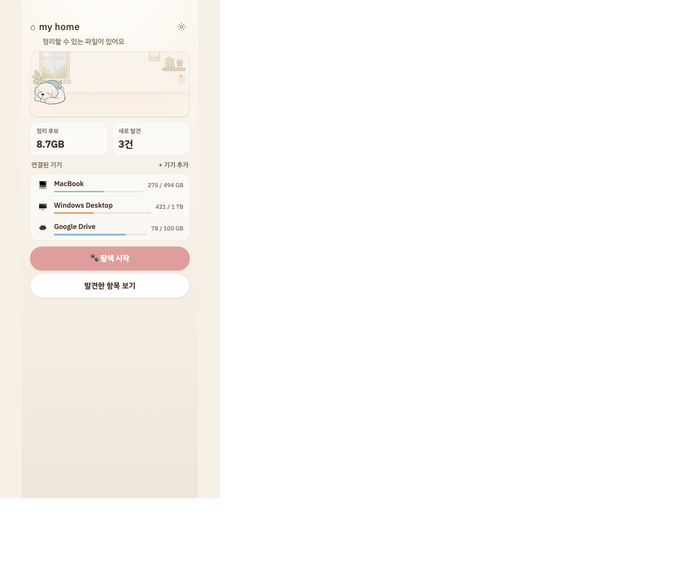

- **정리 후보** — 지금 비울 수 있을 법한 용량 요약 (클릭 시 탄소·비용 추정치)
- **새로 발견** — 중복 · 비슷한 사진 · 메일 등 발견 허브
- **연결된 기기** — MacBook / Drive / Gmail / 네이버 등 (수에 따라 창 높이 조절)
- **서식지** — 설정에서 고른 펫이 방 안을 돌아다님
- **탐색 시작** — 바탕화면 펫이 공간을 돌아다니며 스캔

---

### 2) 설정 — 테마 · 펫 · Google · 네이버

톱니바퀴에서 테마, 데스크톱 펫, Google OAuth, 네이버 IMAP을 설정합니다.

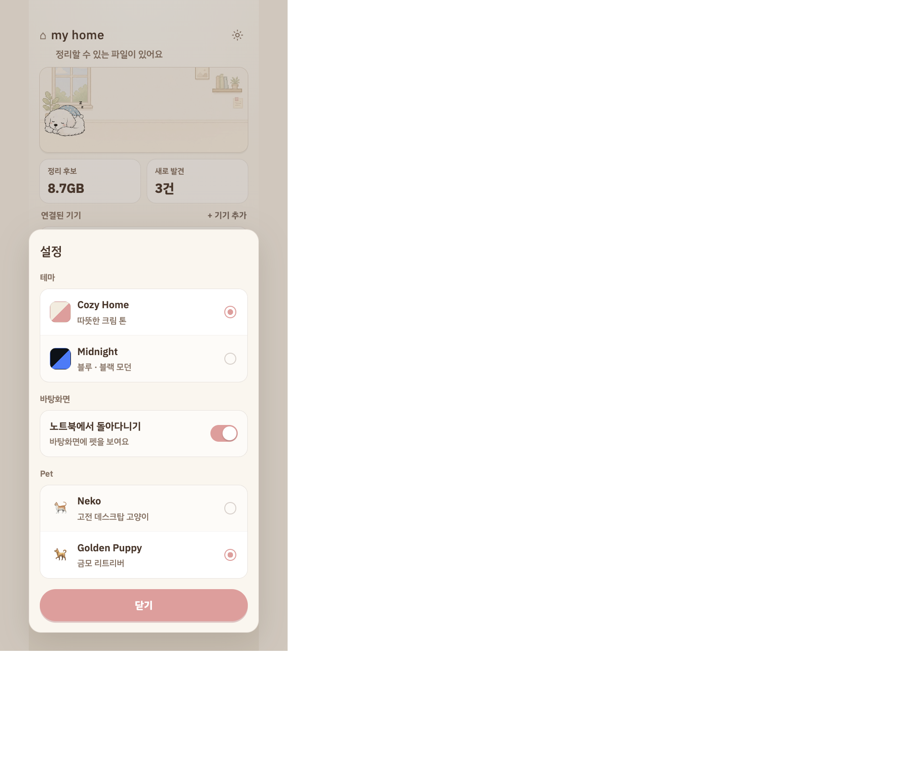

| 항목 | 설명 |
|------|------|
| **Cozy Home / Midnight** | 크림 톤 · 블루·블랙 모던 |
| **노트북에서 돌아다니기** | 바탕화면 펫 on/off |
| **Pet** | Neko(고양이) / Golden Puppy(강아지) — 서식지에 선택한 하나만 |
| **Google 연결** | Desktop Client ID → Drive·Gmail OAuth |
| **Gmail 정리** | 스팸 · 90일+ 안읽음 **실API** 추천 |
| **네이버 메일** | IMAP + 앱 비밀번호 · 오래된 첨부 MD5 |

---

### 3) Mini 홈 — Midnight

블루·블랙 모던 테마. 방 일러스트·창 배경색도 Midnight에 맞춥니다.

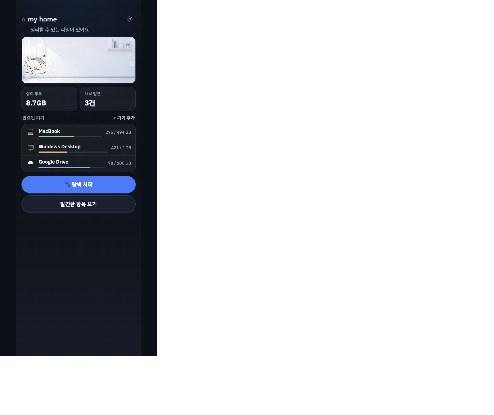

---

### 4) 새로 발견 → 정리 허브

**새로 발견 N건**을 누르면 후보별로 나뉩니다.

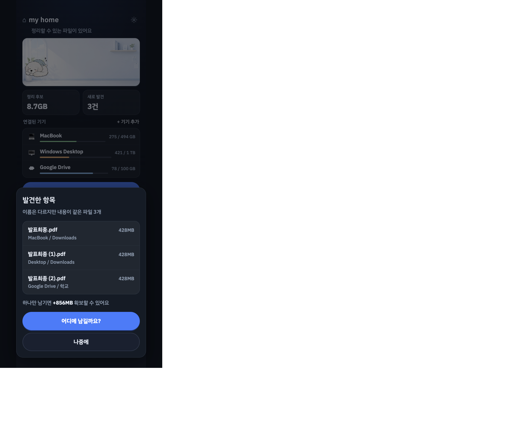

| 종류 | 의미 | 사용자 선택 |
|------|------|-------------|
| **똑같은 파일** | MD5/BLAKE3 완전 동일 · Drive 교차 가능 | **여러 위치에 남기기** 후 나머지 휴지통 |
| **비슷한 사진** | Czkawka `image` 지각 해시 (Pictures·Desktop) | 1장 / 3장 추천 |
| **메일 정리** | Gmail 스팸·오래된 안읽음 / 네이버 대용량 첨부 | 추천 확인 |

파이프라인 메모: [`docs/SIMILARITY_PIPELINE.md`](docs/SIMILARITY_PIPELINE.md)

---

## 핵심 흐름

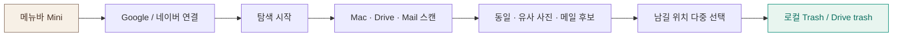

메타데이터·해시 중심 · 파일 본문은 BIUM 서버로 전송하지 않습니다.

### 4단계 파이프라인 한눈에 보기

```mermaid
flowchart LR
  subgraph STEP1["1 · 유사 사진"]
    direction TB
    P1["Czkawka image"]
    P2["Gradient perceptual hash"]
    P3["Pictures · Desktop<br/>이미지 디코드"]
    P4["max difference · 8"]
    P1 --> P2 --> P3 --> P4
  end

  subgraph STEP2["2 · 유사 문서"]
    direction TB
    D1["Filename heuristic"]
    D2["final · 최종 · vN 제거"]
    D3["파일명 stem<br/>빠른 후보 생성"]
    D4["confidence · Review"]
    D1 --> D2 --> D3 --> D4
  end

  subgraph STEP3["3 · Exact 확정"]
    direction TB
    E1["Size bucket → BLAKE3"]
    E2["Node SHA-256 fallback"]
    E3["512KB 이상<br/>약 28초 예산"]
    E4["time budget · ~28s"]
    E1 --> E2 --> E3 --> E4
  end

  subgraph STEP4["4 · 후보 생성"]
    direction TB
    C1["Similar photos"]
    C2["Similar docs · Exact"]
    C3["신뢰도별 Findings Hub"]
    C4["final control · User"]
    C1 --> C2 --> C3 --> C4
  end

  P4 ==> D1
  D4 ==> E1
  E4 ==> C1

  classDef photo fill:#f9e8d6,stroke:#e7883a,color:#71421e
  classDef docs fill:#f7f0d9,stroke:#d5a331,color:#6e5719
  classDef exact fill:#dcefe8,stroke:#168c73,color:#0d604e
  classDef result fill:#e4ebf7,stroke:#4f72ae,color:#29466f
  class P1,P2,P3,P4 photo
  class D1,D2,D3,D4 docs
  class E1,E2,E3,E4 exact
  class C1,C2,C3,C4 result

  style STEP1 fill:#fffaf4,stroke:#e7883a,stroke-width:2px
  style STEP2 fill:#fffdf4,stroke:#d5a331,stroke-width:2px
  style STEP3 fill:#f5fbf8,stroke:#168c73,stroke-width:2px
  style STEP4 fill:#f6f8fc,stroke:#4f72ae,stroke-width:2px
```

발표용 화면: [`docs/pipeline-slides.html`](docs/pipeline-slides.html)

### 전체 기술 파이프라인 — 로컬 엔진 · 오픈소스 · 클라우드

> 현재 런타임에는 별도 생성형 AI/임베딩 모델이 없습니다.
> 실제 탐지는 **Czkawka의 BLAKE3·지각 해시**와 BIUM의 규칙 기반 로직이 담당합니다.

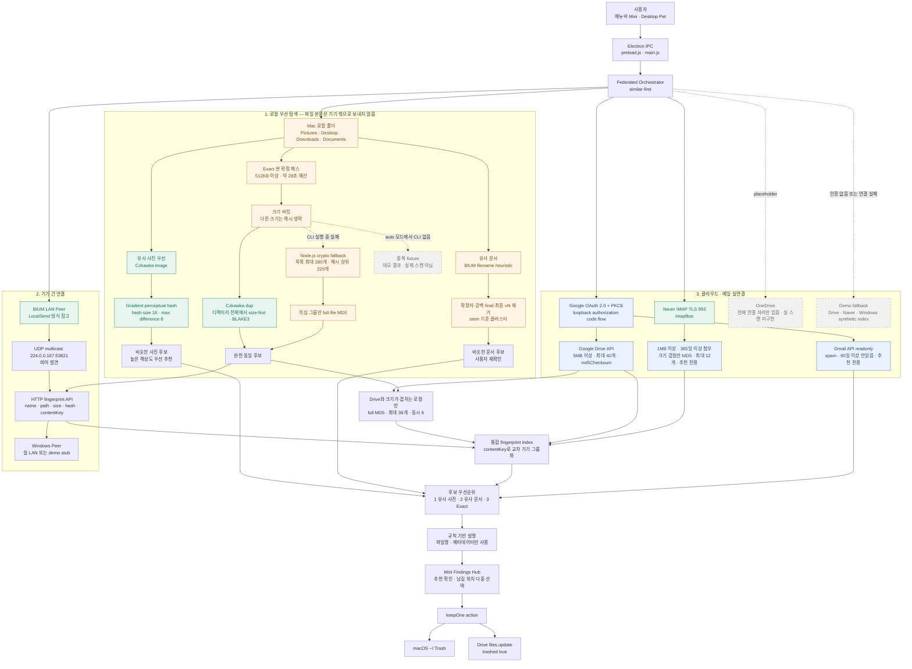

#### 실제 사용 OSS와 “모델” 구분

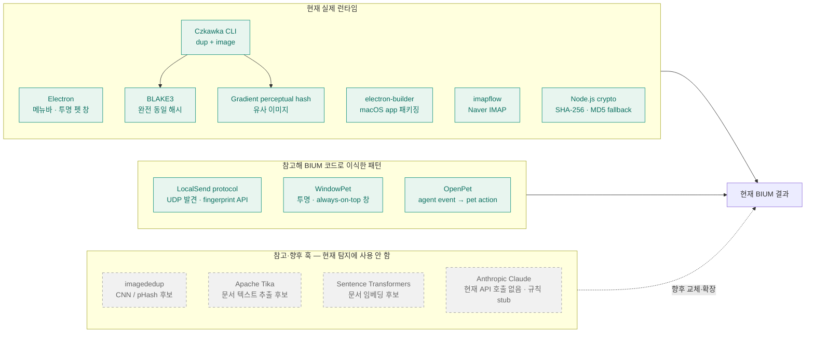

| 구분 | 실제 연결/역할 | 전송 데이터 |
|------|----------------|-------------|
| **Mac 로컬** | Czkawka + Node fallback | 외부 전송 없음 |
| **LAN Peer** | UDP 발견 + HTTP fingerprint API | 이름·경로·크기·해시·contentKey, 파일 본문 제외 |
| **Google Drive** | OAuth 2.0 PKCE + Drive API | 5MB 이상 파일 메타데이터·`md5Checksum`; 삭제 시 `trashed=true` |
| **Gmail** | Gmail API `readonly` | 스팸·오래된 안읽음 메타데이터/건수; 삭제 미연결 |
| **Naver Mail** | `imapflow`, TLS 993 | 오래된 대용량 첨부를 선택적으로 읽어 MD5; 삭제는 메일함에서 직접 |
| **OneDrive** | UI/디바이스 자리만 존재 | 실 OAuth·스캔·삭제 미구현 |
| **Demo 경로** | Windows stub · Drive/Naver fallback · 중복 fixture | 합성 인덱스/후보이며 UI에서 demo로 표시 |

---

## 동일 vs 유사 — 비용 · 이득

BIUM은 **모든 파일을 전수 해싱하지 않습니다.**
완전 동일(exact)과 유사(similar)는 **연산 단가**와 **정리 이득**이 반대 방향으로 갈 수 있어서, 둘을 나눠 둡니다.

### Exact duplicate — 싼 확정 패스

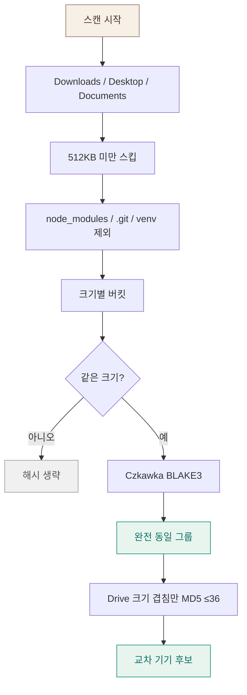

- 페더레이션 Exact 패스의 기본 시간 예산은 **~28초**
- Czkawka 경로는 폴더를 직접 size-first 스캔하며 별도 파일 수 상한이 없음
- Node fallback만 목록 **최대 280개**, 큰 파일 상위 **220개** partial SHA-256 → 의심 그룹 full MD5
- 비싼 구간: 동일-size 그룹의 full BLAKE3 · 타임아웃 전 디스크 읽기

### Similar — 연산은 더 비쌀 수 있지만 낭비 밀도↑

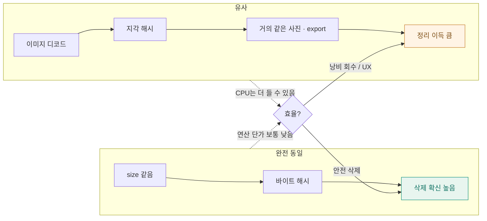

| | 완전 동일 | 유사 사진 |
|--|--|--|
| 핵심 | size 같으면 해시 비교 | 픽셀 → perceptual hash |
| 스킵 | size 다르면 거의 즉시 탈락 | 이미지마다 디코드 |
| BIUM | min 512KB · BLAKE3 | Pictures·Desktop · min 20KB · timeout ~150s |

- **연산만** 보면 “유사 = 더 싸다”는 틀리기 쉬움
- **정리 이득 / 체감**이면 유사(거의 같은 사진·최종본·압축본)가 더 효율적일 수 있음
- 문서는 파일명 stem 클러스터로 후보를 거의 공짜로 뽑을 수 있음 (정확도는 낮음)

### 권장 우선순위

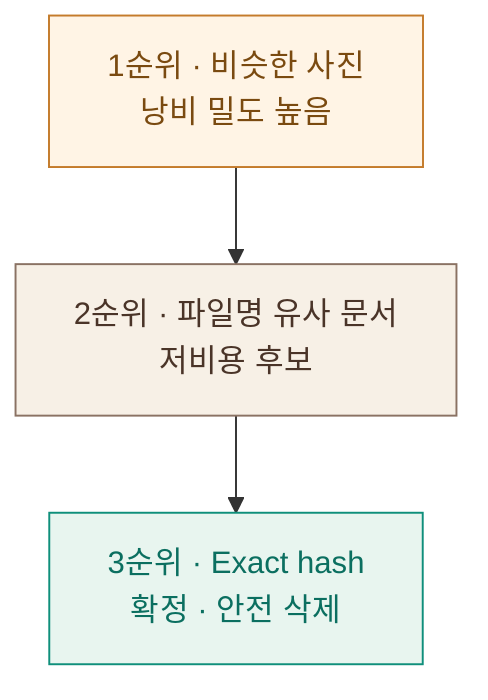

Exact는 제거하지 않습니다. **비싸게 쓰지 않고** size-bucket · min size · exclude · time budget · Drive size-overlap MD5를 유지합니다.

**구현:** 페더레이션 스캔은 이미 `similar-first` 순서입니다.
(`electron/orchestrator.js` · `scanPriority: "similar-first"`).

1. 비슷한 사진 → 2. 파일명 유사 문서 → 3. Exact 확정(≥512KB · ~28s) → 4. Drive/Mail 조인

---

## 설치 (macOS)

```bash
cd digital-home-prototype
npm install
npm run install:local
```

- `/Applications/BIUM.app`
- 바탕화면 `BIUM.app`

메뉴바 집 아이콘을 클릭해 Mini를 엽니다. (Dock 아이콘 없음 · `LSUIElement`)

개발 실행:

```bash
cd digital-home-prototype
npm start
```

브라우저로 UI만 보기:

```bash
cd digital-home-prototype
npx --yes serve -l 5173 .
# http://localhost:5173
```

### Google / Gmail 실연결

1. Google Cloud Desktop OAuth Client ID  
2. **Drive API** · **Gmail API** 사용 설정  
3. BIUM 설정 → Google로 로그인 / Gmail 연결  

### 네이버 메일

1. 메일 설정에서 IMAP 사용함  
2. 2단계 인증 **앱 비밀번호**  
3. BIUM 설정 → 네이버로 연결  

---

## 사내 KPI 대시보드 (웹)

조직 단위 **데이터 절감 · 비용 · 다음 달 기대치** 프로토타입:

```bash
cd digital-home-prototype/org-dashboard
npx --yes serve -p 5177
# http://localhost:5177
```

- 데모 스키마: `org-dashboard/data/sample.json`  
- BIUM 절감 공식과 동일 오더 (`GB × 36000/8.7` 원/년, `0.04 kgCO₂e/GB·년`)  
- 자세한 설명: [`org-dashboard/README.md`](digital-home-prototype/org-dashboard/README.md)

---

## 사용한 오픈소스

통째 fork 대신 **필요한 패턴·바이너리·에셋만** 참고·이식했습니다.  
상세 전략: [`docs/OSS_COMPOSITION.md`](docs/OSS_COMPOSITION.md)

### 런타임 · 빌드

| 프로젝트 | 라이선스 | 용도 |
|----------|----------|------|
| [Electron](https://github.com/electron/electron) | MIT | macOS 메뉴바 앱 · Desktop Pet 창 |
| [electron-builder](https://github.com/electron-userland/electron-builder) | MIT | `.app` 패키징 (`npm run dist`) |
| [imapflow](https://github.com/postalsys/imapflow) | MIT | 네이버 메일 IMAP |

### 탐색 · 중복 · 에이전트 패턴

| 프로젝트 | 라이선스 | BIUM에서의 역할 |
|----------|----------|-----------------|
| [Czkawka](https://github.com/qarmin/czkawka) | MIT | 중복 `dup` + 유사 이미지 `image` CLI |
| [imagededup](https://github.com/idealo/imagededup) | Apache-2.0 | 사진 near-duplicate 장기 훅 자리 |
| [Apache Tika](https://tika.apache.org/) | Apache-2.0 | 문서 텍스트 추출 훅 자리 |
| [Sentence Transformers](https://www.sbert.net/) | Apache-2.0 | 문서 임베딩 유사도 훅 자리 |
| [LocalSend](https://github.com/localsend/localsend) / [protocol](https://github.com/localsend/protocol) | MIT | LAN 기기 발견 아이디어 → `electron/peers/lanPeer.js` |
| [WindowPet](https://github.com/SeakMengs/WindowPet) | MIT | 투명·always-on-top 패턴 → `electron/desktopPet.js` |
| [OpenPet](https://github.com/X-T-E-R/OpenPet) | — | Agent 이벤트 → 펫 행동 → `electron/agentEvents.js` |

### 펫 · 스프라이트

| 프로젝트 | 라이선스 | BIUM에서의 역할 |
|----------|----------|-----------------|
| [crgimenes/neko](https://github.com/crgimenes/neko) | BSD-2-Clause | 고전 Neko 스프라이트 |
| [adryd325/oneko.js](https://github.com/adryd325/oneko.js) | — | oneko 8×4 / 32px 그리드 참고 |
| PawPal 계열 GIF | 각 저장소 라이선스 | Golden Puppy (`assets/pets/pawpal-puppy`) |

크레딧: [`digital-home-prototype/assets/pets/neko/CREDITS.md`](digital-home-prototype/assets/pets/neko/CREDITS.md)

### 클라우드 API

| API | 용도 |
|-----|------|
| Google Drive API | 메타데이터 · MD5 · trash (본문 미업로드) |
| Gmail API | 스팸 · 90일+ 안읽음 건수 추천 |
| 네이버 IMAP | 오래된 첨부 후보 · MD5 교차 |

---

## 저장소 구조

```text
.
├── digital-home-prototype/     # BIUM macOS 앱 (Electron)
│   ├── electron/               # tray, pet, federated scan, OAuth, IMAP
│   │   ├── actions/keepOne.js  # 다중 위치 keep → trash
│   │   └── providers/          # google.js, naverImap.js
│   ├── org-dashboard/          # 사내 절감 KPI 웹 프로토타입
│   ├── js/ css/                # Mini + Home UI
│   ├── assets/                 # 펫 PNG/GIF, 방 배경
│   └── vendor/bin/             # czkawka_cli
├── docs/
│   ├── screenshots/
│   ├── OSS_COMPOSITION.md
│   ├── SIMILARITY_PIPELINE.md
│   └── 피피티_개요.md
└── README.md
```

---

## 발표 자료

문제 정의 · 페인포인트 · 기대효과 슬라이드 개요는  
[`docs/피피티_개요.md`](docs/피피티_개요.md) 를 참고하세요.

---

## 라이선스

앱 코드: MIT (해커톤용)  
포함 바이너리·에셋은 각 원저작물 라이선스를 따릅니다.
