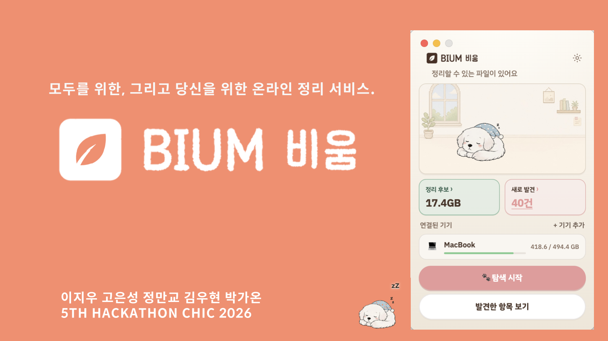
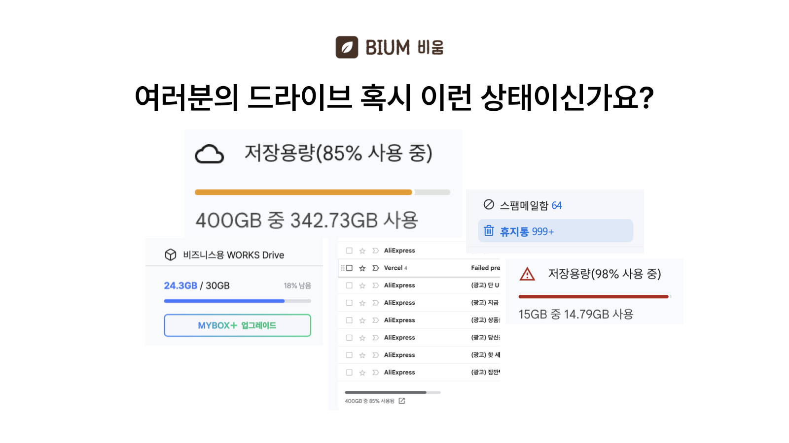
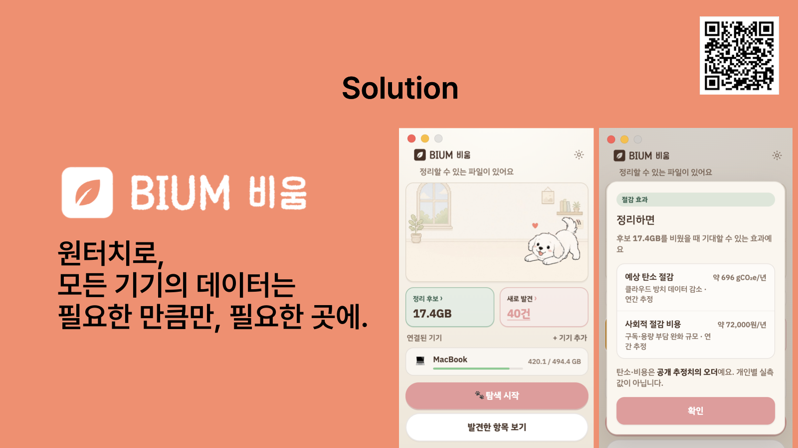
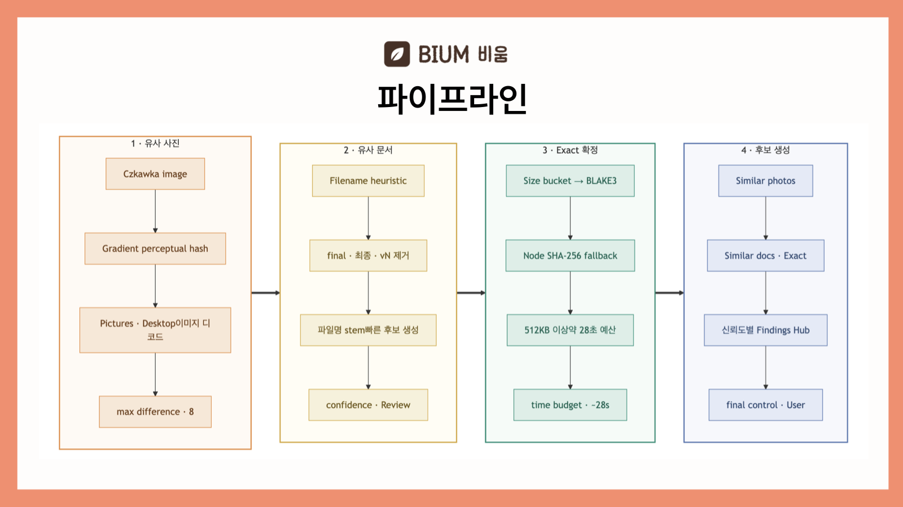
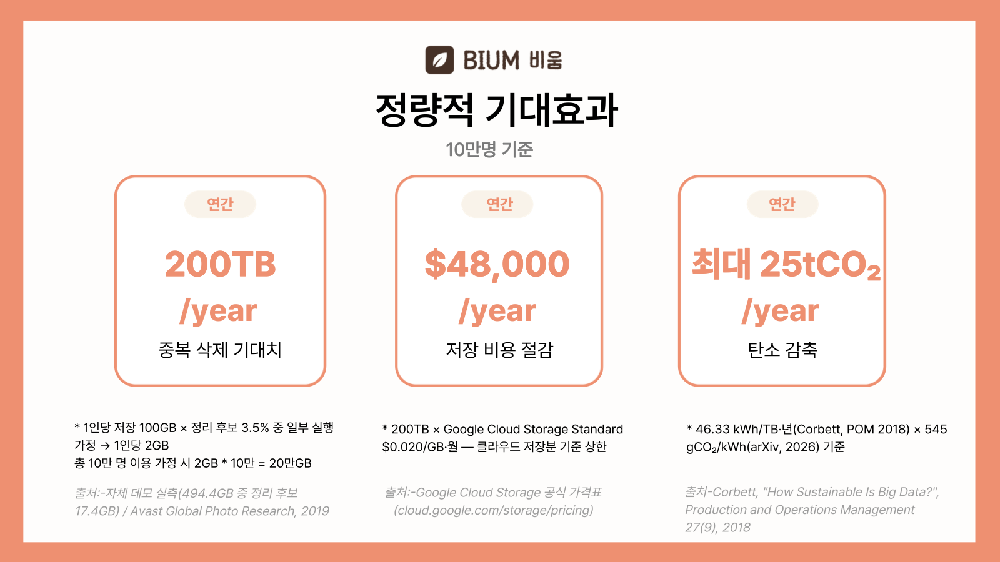
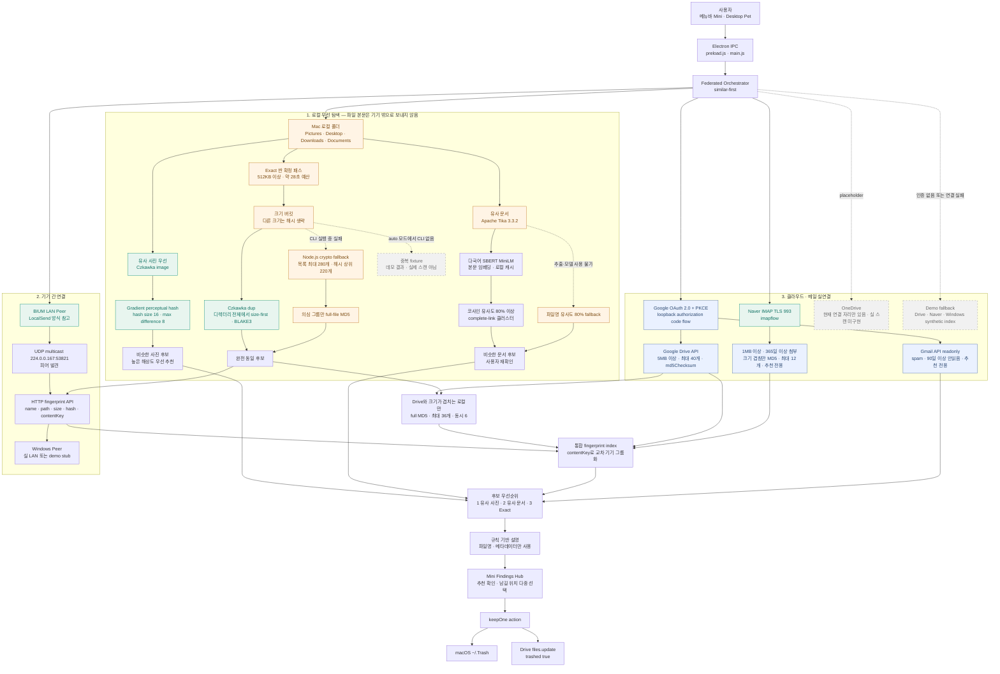
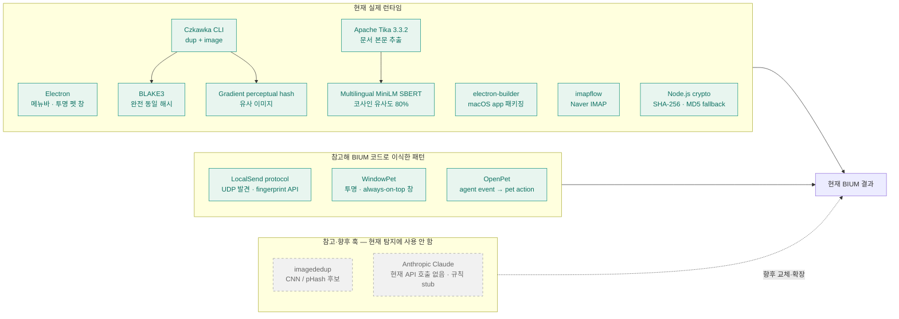
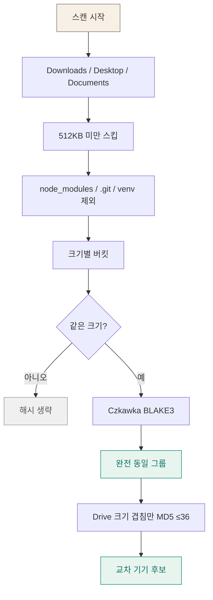
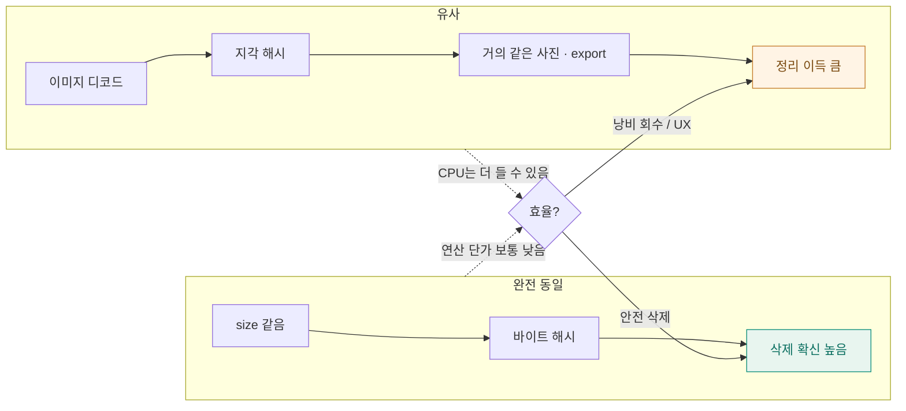
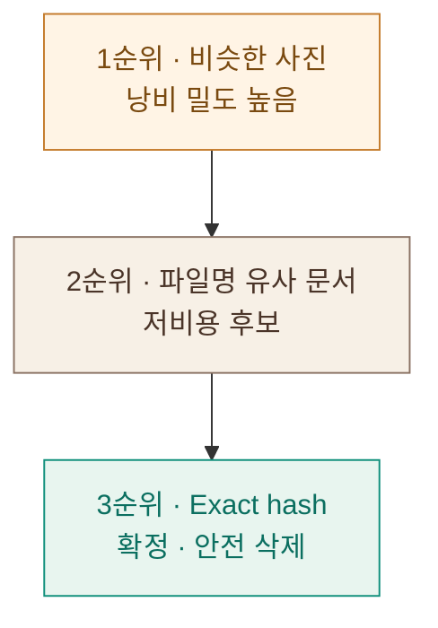

# BIUM — my home

> 메뉴바에서 여는 **작은 디지털 집**.
> 바탕화면 펫이 Mac · Drive · Gmail · 네이버 메일을 돌아다니며
> **완전 동일 · 비슷한 사진 · 메일 정리 후보**를 묶어 추천합니다.

macOS **메뉴바 유틸리티**(Electron) · CHIC 해커톤

---

> ### 📌 이 저장소에 대하여
>
> 이 저장소는 **팀 프로젝트 [dlwldn4824/BIUM-](https://github.com/dlwldn4824/BIUM-)의 Fork**입니다.
> 원본 저장소의 커밋 히스토리와 팀원들의 개발 기록을 그대로 보존하고 있으며,
> README에 **제가 이 프로젝트에서 담당한 역할과 기여**를 개인 아카이브 관점으로 덧붙였습니다.
>
> - 팀 공식 문서는 아래 [프로젝트 개요](#프로젝트-개요) 이하 원문을 그대로 유지했습니다.
> - 개인 기록은 [My Role](#my-role-) 이후 섹션에 정리되어 있습니다.

---

## 목차

**문제 정의**
- [프로젝트 개요](#프로젝트-개요)
- [Pain Point 분석 (6하원칙)](#pain-point-분석-6하원칙)
- [사용자 관점 — 3가지 Persona](#사용자-관점--3가지-persona)
- [How Might We?](#how-might-we)
- [프로젝트 의의](#프로젝트-의의)
- [정량적 기대효과](#정량적-기대효과)

**팀 공식 문서**
- [앱 다운로드](#앱-다운로드)
- [화면으로 보는 BIUM](#화면으로-보는-bium)
- [핵심 흐름 · 탐지 파이프라인](#핵심-흐름)
- [저장소 구조](#저장소-구조)

**개인 아카이브 기록**
- [My Role ⭐](#my-role-)
- [My Contributions ⭐](#my-contributions-)
- [Development Process](#development-process)
- [Lessons Learned](#lessons-learned)
- [Future Improvements](#future-improvements)
- [Original Repository](#original-repository)

---

## 프로젝트 개요

| 항목 | 내용 |
|------|------|
| **프로젝트명** | BIUM — my home |
| **한 줄 설명** | 메뉴바에서 여는 작은 디지털 집. 흩어진 파일·사진·메일의 정리 후보를 묶어 추천하는 데스크톱 유틸리티 |
| **진행 배경** | CHIC 해커톤 |
| **프로젝트 기간** | 2025.08.14 ~ 2025.08.15 (2일) |
| **팀 규모** | 5명 |
| **나의 역할** | 아이디어 및 개요|
| **결과 / 수상** | `<사용자 작성>` |
| **원본 저장소** | [dlwldn4824/BIUM-](https://github.com/dlwldn4824/BIUM-) |

### Hackathon 주제

**[CHIC 해커톤 — Sustainability Engine](https://sustainability-engine.lovable.app/)**

> 지속가능성(Sustainability)을 주제로 한 해커톤으로, BIUM은 **데이터 저장이 유발하는
> 환경 비용**을 사용자 경험 문제로 재정의해 참가했습니다.

### ESG 적 가치

최근 국가적으로 AI의 개발을 앞다투어 총력전을 기울이는 추세에서, 데이터센터의 환경파괴 문제가 더더욱 부각되고 있다. 매년 데이터센터는 막대한 양의 물, 이를 가동시킬 에너지 소모로 지역 환경 파괴에 큰 역할을 하고있다. 이에 따라 우리 팀은 데이터센터 및 클라우드에 저장되는 데이터를 사용자 판단  기반으로 중복 처리, 삭제, 및 레포지토리 최적화 솔루션을 제공하여 개인 사용자, 기업 사용자, 클라우드/데이터 센터 제공자, 3가지의 pain point를 모두 해결할 수 있는 ESG 솔루션을 만들었다.

### 해결하려는 문제

로컬 디스크와 여러 클라우드·메일함에 데이터가 흩어져 있어 사용량은 보여도
중복 여부와 보존 가치는 바로 알기 어렵습니다. BIUM은 이 판단 비용을 줄이기 위해
파일을 하나씩 보여주는 대신 **정리 가능한 묶음**으로 재구성합니다.

### 팀 구성

| 이름 | 역할 | GitHub |
|------|------|--------|
| 이지우 | 아이디어, 프론트엔드, 백엔드 | [@dlwldn4824](https://github.com/dlwldn4824) |
| 정만교 (본인) | 아이디어, 백엔드  | [@i1uvmango](https://github.com/i1uvmango) |
| 김우현 |  | - |
| 고은성 |  | |
| 박가온 | 백엔드 | |

---

## Pain Point 분석 (6하원칙)

발표자료의 문제 정의 흐름을 6하원칙으로 정리했습니다.

| 구분 | 내용 |
|------|------|
| **Who** (누가) | 데이터를 계속 쌓기만 하는 **개인 사용자**, 저장 비용을 관리해야 하는 **기업 담당자**, 스토리지 효율을 책임지는 **클라우드 운영자** |
| **What** (무엇을) | 중복 파일, 유사한 사진·영상, 오래된 데이터, 불필요한 백업·첨부가 저장 공간과 비용, 그리고 환경 부담을 차지하는 문제 |
| **When** (언제) | 과제·프로젝트 제출 후, 연속 촬영·편집본 생성 시, 자동 백업이 쌓일 때 — 즉 **정리해야 할 시점마다 미뤄질 때** |
| **Where** (어디서) | 로컬 기기(Mac·Windows), 클라우드(Google Drive), 메일함(Gmail·네이버 메일) 등 **여러 공간에 분산**되어 |
| **Why** (왜) | 환경을 위해서라는 필요성이 와닿지 않고, **정리의 번거로움이 행동을 먼저 가로막기** 때문에 |
| **How** (어떻게) | 사용자가 데이터의 가치를 일일이 판단하지 않아도 되도록, **BIUM이 정리 후보를 묶어 근거와 함께 제시**하고 최종 결정은 사용자가 내리는 방식으로 |

### 문제의 규모

| 지표 | 수치 | 출처 |
|------|------|------|
| 데이터센터 전력 소비 (2024) | **415 TWh** | 국제 에너지 보고서 (~2024) |
| 연평균 소비 전력 증가율 | **+12%** | 국제 에너지 보고서 (~2024) |
| 데이터센터 예상 전력 소비 (2030) | **945 TWh** | 국제 에너지 보고서 (~2024) |
| 이에 따른 탄소 배출 | **526만 톤** | 국제 에너지 보고서 (~2024) |

### 불필요하게 저장되는 데이터 비중

| 유형 | 비중 | 설명 |
|------|------|------|
| **중복 파일** | 전체 데이터의 20~30% | 이름만 다를 뿐, 내용이 동일한 파일들 |
| **유사한 사진/영상** | 전체 사진·영상의 30~40% | 연속 촬영, 편집본, 캡처 등 거의 동일한 사진과 영상 |
| **오래된 데이터** | 기업 데이터의 60% 이상 | 1년 이상 열어보지 않은 파일, 더 이상 사용하지 않는 자료 |
| **불필요한 백업/첨부** | 메일함 용량의 10~20% | 자동 백업, 대용량 첨부파일 등 잊혀진 데이터 |

### 어피니티 다이어그램

인터뷰와 리서치를 통해 도출한 사용자 니즈를 4개 그룹으로 묶었습니다.

| 그룹 | 도출된 니즈 |
|------|-------------|
| **1. 파일이 계속 쌓인다** | 과제·프로젝트 파일이 계속 쌓임 · 팀/부서별 데이터 중복 저장 · 다운로드·캡처·임시 파일까지 모두 저장됨 |
| **2. 정리하기 귀찮고 어렵다** | 뭘 지워도 되는지 판단이 어려움 · 수작업 확인에 시간이 너무 많이 듦 · 폴더 구조가 복잡해 찾기 어려움 · 버전 구분이 어려움 |
| **3. 비용과 리스크가 크다** | 클라우드 저장 비용 부담 · 스토리지 비용 증가 · 필요한 파일을 못 찾음 · 중요 데이터가 중복 백업됨 |
| **4. 자동화 & 통합 관리 필요** | 자동으로 중복을 찾아주길 원함 · 여러 기기/드라이브를 한 번에 관리하고 싶음 · 안전하게 정리하고 복원할 수 있길 원함 · 권한 및 보안 관리 기능 필요 |

---

## 사용자 관점 — 3가지 Persona

문제를 **개인 · 기업 · 클라우드 제공자** 세 관점으로 나누어 정의하고,
각 관점의 Pain Point를 BIUM이 어떻게 해결하는지 매칭했습니다.

### Persona 1 — Digital-Native Student

| 항목 | 내용 |
|------|------|
| **이름 / 나이** | 기찬아 · 24세 |
| **직업** | 컴퓨터공학부 3학년 |
| **특징** | 개발 프로젝트·공모전·대외활동이 많음 / 디지털 사용량 높음 |
| **한마디** | *"정리해야 한다는 건 알지만, 하나하나 확인하는 것이 너무 귀찮아 일단 저장해두고 나중으로 미룸."* |

**Pain Point**
- 과제, 개발 프로젝트, 공모전, 대외활동을 하면서 중복 파일이 계속 쌓임
- 제출 후 정리하는 과정이 귀찮아 매월 불필요한 cloud 비용을 지불함
- 사진·문서를 하나씩 열어봐야 삭제 여부를 알 수 있음
- 스마트폰·PC·외장하드·iCloud·Google Drive 등에 같은 파일이 존재
- 추억 사진·중요 문서까지 실수로 삭제할까 걱정

**✅ BIUM의 해결**
- 판단에 필요한 정보를 먼저 제공하고, 그에 따른 정리 서비스를 제공
- Local + Cloud를 함께 분석해 동일·유사 데이터를 통합해서 보여줌
- 삭제 대상과 보호 대상을 구분하고, **근거를 제시한 뒤 최종 결정은 사용자가** 내림
- 중복·불필요 데이터를 선별해 저장공간을 효율적으로 사용

---

### Persona 2 — Game Data / Cloud Optimization Manager

| 항목 | 내용 |
|------|------|
| **이름 / 나이** | 김구름 · 38세 |
| **직책** | Game Data & Cloud Infrastructure Manager |
| **회사 / 경력** | Nexon · IT 인프라 14년 · Cloud 8년 |
| **한마디** | *"게임 Asset은 파일 하나가 수십 GB까지 커질 수 있고, 같은 Texture와 Mesh가 여러 버전으로 반복 저장된다. 데이터를 지우기는 어렵지만, 불필요한 저장 비용은 줄여야 한다."* |

**Pain Point**
- 오래된 DB·모델·문서가 현재 업무에 필요한지 한눈에 파악하기 어려움
- 개발 서버·클라우드·백업·프로젝트 저장소 등에 데이터가 분산
- 업무 데이터·원본·백업 데이터를 잘못 삭제하면 복구 비용과 업무 리스크 발생
- 데이터 증가에 따라 스토리지 비용과 관리 부담이 지속 증가

**✅ BIUM의 해결**
- 조직 절감 KPI 대시보드로 기기별 정리 현황과 절감량을 집계
- 부서별 절감 현황·주간 절감 추이·다음 달 기대 절감을 함께 제시
- 삭제 대상과 보호 대상을 구분해 **복구 리스크 없이** 정리 우선순위를 판단

---

### Persona 3 — Cloud Storage Optimization Manager

| 항목 | 내용 |
|------|------|
| **이름 / 나이** | Steve Jobs · 39세 |
| **직책** | Cloud Storage Manager |
| **회사 / 경력** | Google · IT 인프라 12년 · Cloud 6년 |
| **한마디** | *"고객 데이터를 안전하게 보관하면서도, 필요 이상의 비싼 스토리지 비용이 발생하지 않도록 만들어야 하는 사람."* |

**Pain Point**
- 고객 데이터를 안전하게 보관해야 하는 의무와 비용 최적화 사이의 균형
- 기존 Lifecycle Policy는 **사용 빈도·경과 시간 기반**으로만 정리 우선순위를 추정

**✅ BIUM의 해결 — Cloud Storage Optimization Layer**

클라우드 운영 기업 관점에서 BIUM은 살짝 다른 역할을 합니다.

| 구분 | 방식 |
|------|------|
| **기존 Google Lifecycle Policy** | 사용 빈도·경과 시간 기반으로 정리 우선순위 추정 → 미사용 부분을 더 저렴한 스토리지 클래스로 이동 (`SetStorageClass`) |
| **BIUM** | **실제 파일을 스윕해 상태를 파악** → 사용자 판단 기반 우선순위·storage 최적화 |

> 시간 기반 추정이 아니라 **파일의 실제 중복·유사 상태**를 근거로 삼기 때문에,
> 저비용 스토리지 이동 판단의 정확도를 높일 수 있습니다.

---

## How Might We?

세 Persona의 Pain Point를 하나의 질문으로 수렴했습니다.

> ### 사용자가 데이터의 가치를 일일이 판단하지 않아도,
> ### 필요한 데이터는 **안전하게 보존**하면서
> ### **불필요한 저장 공간**은 줄일 수 있을까?

이 질문에 대한 BIUM의 답은 **"판단을 대신하지 않고, 판단의 근거를 제공한다"** 입니다.

| HMW 요소 | BIUM의 답 |
|----------|-----------|
| 일일이 판단하지 않아도 | 해시·유사도·메타데이터로 **정리 후보를 자동 그룹화** |
| 안전하게 보존하면서 | 삭제 대신 **남길 위치 선택** · 저비용 스토리지 이동 옵션 제공 |
| 불필요한 저장 공간은 줄이도록 | 절감 용량·비용·탄소를 **함께 환산해 제시** |
| 최종 결정은 | **항상 사용자가** — BIUM은 추천만 하고 강제 삭제하지 않음 |

### 경쟁사 대비 차별점

| 서비스 | 한계 |
|--------|------|
| **Finder** | 중복·유사 파일 판단과 클라우드 통합이 약함 |
| **Clean Email** | 로컬·클라우드 파일 통합 관리 능력 부족 |
| **CleanMyMac** | 멀티 디바이스·멀티클라우드 관리가 어려움 |
| **DeDuplicate** | 장기 미사용·분산 저장 데이터까지 통합 정리하진 못함 |
| **MultCloud** | 무엇을 지워야 할지 판단해주는 정리 기능 부족 |

> BIUM은 **관리 범위의 통합성**(로컬 + 클라우드 + 메일)과
> **정리 기능의 지능화**(해시 + 임베딩 + 메타데이터) 두 축을 동시에 만족하는 위치를 목표로 했습니다.

---

## 프로젝트 의의

| 구분 | 내용 |
|------|------|
| **01. 데이터 관리 문제를 환경 문제로 재정의** | 최근 데이터·클라우드 산업의 저장 효율화 흐름에서 출발해, 사용자가 환경 문제로 인식하기 어려웠던 중복·유사·장기 미사용 데이터의 관리 문제를 **환경적 가치와 연결**했습니다. |
| **02. 아이디어에서 실제 서비스까지, 하루 만에** | 문제 정의부터 UI/UX 설계, Desktop App 개발, GitHub 공개, Google Drive 실연동까지 **하루 안에 구현**하며 아이디어의 기술적 실현 가능성을 검증했습니다. |
| **03. 오픈소스를 조합한 확장 가능한 탐색 파이프라인** | 오픈소스를 단순 활용하는 데 그치지 않고 **해싱 기반 완전 중복 탐지 + 임베딩 기반 유사 탐지 + 로컬 기기·클라우드 연동**을 하나의 파이프라인으로 설계했습니다. |

---

## 정량적 기대효과

> ⚠️ 아래 수치는 **10만 명 기준 시나리오 추정치**이며, 실측 성과가 아닙니다.

| 지표 | 연간 기대치 | 산출 근거 |
|------|-------------|-----------|
| **중복 삭제 기대치** | 200 TB / year | 1인당 저장 100GB × 정리 후보 3.5% 중 일부 실행 가정 → 1인당 2GB × 10만 명 |
| **저장 비용 절감** | $48,000 / year | 200TB × Google Cloud Storage Standard $0.020/GB·월 기준 상한 |
| **탄소 감축** | 최대 25 tCO₂ / year | 46.33 kWh/TB·년(Corbett, POM 2018) × 545 gCO₂/kWh(arXiv, 2026) 기준 |

**출처**
- 자체 데모 실측 (494.4GB 중 정리 후보 17.4GB) / Avast Global Photo Research, 2019
- [Google Cloud Storage 공식 가격표](https://cloud.google.com/storage/pricing)
- Corbett, *"How Sustainable Is Big Data?"*, Production and Operations Management 27(9), 2018

### 환경과 관련한 긍정적 영향

- **데이터센터 전력 사용 부담 감소** — 저장·백업·복제해야 할 데이터가 줄어 서버와 냉각에 필요한 에너지 수요를 낮춤
- **저장 인프라 자원 소비 완화** — 불필요한 데이터 축적을 줄여 추가 저장장치·서버 증설에 필요한 자원 수요를 완화
- **디지털 탄소배출 저감에 기여** — 데이터 저장과 관리에 필요한 에너지 사용을 줄여 장기적으로 탄소배출 감소에 기여

> **쓸데없는 저장 ↓ → 서버 부담 ↓ → 환경 부담 ↓**

---

## 앱 다운로드

[GitHub Releases에서 최신 BIUM 받기](https://github.com/dlwldn4824/BIUM/releases/latest)

- **Windows 10/11 (64비트)**: `BIUM-*-win-x64.exe`
- **Apple Silicon Mac**: `BIUM-*-mac-arm64.dmg`
- **Intel Mac**: `BIUM-*-mac-x64.dmg`

현재 배포본은 코드 서명 전 데모 빌드입니다. 처음 실행할 때 Windows SmartScreen에서는
`추가 정보 → 실행`, macOS에서는 Finder에서 앱을 우클릭한 뒤 `열기`를 선택하세요.

문서 본문 유사도 탐지는 Java 17 이상이 필요합니다. SBERT 모델은 처음 탐색할 때 약
118MB를 한 번 내려받아 `~/.bium/models`에 저장하며, 이후에는 로컬 캐시만 사용합니다.

---

## 화면으로 보는 BIUM

### 1) Mini 홈 — Cozy Home

메뉴바 아이콘을 누르면 뜨는 컴팩트 팝오버입니다.  
정리 후보 용량, 새로 발견한 건수, 연결된 기기, 탐색 CTA가 한 화면에 모입니다.


- **정리 후보** — 지금 비울 수 있을 법한 용량 요약 (클릭 시 탄소·비용 추정치)
- **새로 발견** — 중복 · 비슷한 사진 · 메일 등 발견 허브
- **연결된 기기** — MacBook / Drive / Gmail / 네이버 등 (수에 따라 창 높이 조절)
- **서식지** — 설정에서 고른 펫이 방 안을 돌아다님
- **탐색 시작** — 바탕화면 펫이 공간을 돌아다니며 스캔

---

### 2) 설정 — 테마 · 펫 · Google · 네이버

톱니바퀴에서 테마, 데스크톱 펫, Google OAuth, 네이버 IMAP을 설정합니다.


| 항목 | 설명 |
|------|------|
| **Cozy Home / Midnight** | 크림 톤 · 블루·블랙 모던 |
| **노트북에서 돌아다니기** | 바탕화면 펫 on/off |
| **Pet** | Neko(고양이) / Golden Puppy(강아지) — 서식지에 선택한 하나만 |
| **Google 연결** | Desktop Client ID → Drive·Gmail OAuth |
| **Gmail 정리** | 스팸 · 90일+ 안읽음 **실API** 추천 |
| **네이버 메일** | IMAP + 앱 비밀번호 · 오래된 첨부 MD5 |

---

### 3) Mini 홈 — Midnight

블루·블랙 모던 테마. 방 일러스트·창 배경색도 Midnight에 맞춥니다.


---

### 4) 새로 발견 → 정리 허브

**새로 발견 N건**을 누르면 후보별로 나뉩니다.


| 종류 | 의미 | 사용자 선택 |
|------|------|-------------|
| **똑같은 파일** | MD5/BLAKE3 완전 동일 · Drive 교차 가능 | **여러 위치에 남기기** 후 나머지 휴지통 |
| **비슷한 사진** | Czkawka `image` 지각 해시 (Pictures·Desktop) | 1장 / 3장 추천 |
| **메일 정리** | Gmail 스팸·오래된 안읽음 / 네이버 대용량 첨부 | 추천 확인 |

파이프라인 메모: [`docs/SIMILARITY_PIPELINE.md`](docs/SIMILARITY_PIPELINE.md)

---

## 발표자료로 보는 BIUM

21페이지 발표 PDF에서 문제·솔루션·탐지 구조·기대효과를 보여주는 핵심 장면을
선별했습니다.



### 문제 — 저장 공간은 차지만 무엇을 지울지 판단하기 어렵다



로컬 디스크와 여러 클라우드·메일함에 데이터가 흩어져 있어 사용량은 보여도
중복 여부와 보존 가치는 바로 알기 어렵습니다. BIUM은 이 판단 비용을 줄이기 위해
파일을 하나씩 보여주는 대신 정리 가능한 묶음으로 재구성합니다.

### 솔루션 — 개인과 조직을 하나의 정리 흐름으로 연결



개인 화면에서는 메뉴바 Mini와 데스크톱 펫이 탐색을 안내하고, 사용자가 남길 위치를
직접 선택합니다.


조직 화면에서는 기기별 정리 현황과 절감량을 집계해 저장 비용과 탄소 영향을 함께
확인할 수 있도록 구성했습니다.

### 탐지 파이프라인 — 유사 후보부터 찾고 Exact로 확정



발표 PDF 제작 당시에는 유사 문서를 파일명 휴리스틱으로 설명했습니다. 현재 런타임은
여기에 **Apache Tika 본문 추출 + 다국어 SBERT 임베딩 + 코사인 유사도 80%**를
추가했으며, 사용할 수 없을 때만 파일명 유사도로 대체합니다.

### 기대효과 — 저장량·비용·탄소를 함께 줄이는 구조



발표 자료의 수치는 10만 명이 각자 정리 후보의 일부를 실제로 비운다는 가정에서 산출한
기대치입니다. 확정 절감량이 아니라 사용자 수, 실행률, 저장소 요금과 전력 배출계수에
따라 달라지는 시나리오 값입니다.

> 산출 근거와 출처는 위 [정량적 기대효과](#정량적-기대효과) 표를 참고하세요.

---

## 핵심 흐름


메타데이터·해시 중심 · 파일 본문은 BIUM 서버로 전송하지 않습니다.

### 4단계 파이프라인 한눈에 보기


발표용 화면: [`docs/pipeline-slides.html`](docs/pipeline-slides.html)

### 전체 기술 파이프라인 — 로컬 엔진 · 오픈소스 · 클라우드

> 문서 본문은 Apache Tika로 로컬 추출하고, 다국어 SBERT MiniLM으로 로컬 임베딩합니다.
> 본문·임베딩은 외부 서버로 전송하지 않으며 코사인 유사도 **80% 이상**만 후보로 묶습니다.



#### 실제 사용 OSS와 “모델” 구분



| 구분 | 실제 연결/역할 | 전송 데이터 |
|------|----------------|-------------|
| **Mac 로컬** | Czkawka + Node fallback | 외부 전송 없음 |
| **LAN Peer** | UDP 발견 + HTTP fingerprint API | 이름·경로·크기·해시·contentKey, 파일 본문 제외 |
| **Google Drive** | OAuth 2.0 PKCE + Drive API | 5MB 이상 파일 메타데이터·`md5Checksum`; 삭제 시 `trashed=true` |
| **Gmail** | Gmail API `readonly` | 스팸·오래된 안읽음 메타데이터/건수; 삭제 미연결 |
| **Naver Mail** | `imapflow`, TLS 993 | 오래된 대용량 첨부를 선택적으로 읽어 MD5; 삭제는 메일함에서 직접 |
| **OneDrive** | UI/디바이스 자리만 존재 | 실 OAuth·스캔·삭제 미구현 |
| **Demo 경로** | Windows stub · Drive/Naver fallback · 중복 fixture | 합성 인덱스/후보이며 UI에서 demo로 표시 |

---

## 동일 vs 유사 — 비용 · 이득

BIUM은 **모든 파일을 전수 해싱하지 않습니다.**
완전 동일(exact)과 유사(similar)는 **연산 단가**와 **정리 이득**이 반대 방향으로 갈 수 있어서, 둘을 나눠 둡니다.

### Exact duplicate — 싼 확정 패스



- 페더레이션 Exact 패스의 기본 시간 예산은 **~28초**
- Czkawka 경로는 폴더를 직접 size-first 스캔하며 별도 파일 수 상한이 없음
- Node fallback만 목록 **최대 280개**, 큰 파일 상위 **220개** partial SHA-256 → 의심 그룹 full MD5
- 비싼 구간: 동일-size 그룹의 full BLAKE3 · 타임아웃 전 디스크 읽기

### Similar — 연산은 더 비쌀 수 있지만 낭비 밀도↑



| | 완전 동일 | 유사 사진 |
|--|--|--|
| 핵심 | size 같으면 해시 비교 | 픽셀 → perceptual hash |
| 스킵 | size 다르면 거의 즉시 탈락 | 이미지마다 디코드 |
| BIUM | min 512KB · BLAKE3 | Pictures·Desktop · min 20KB · timeout ~150s |

- **연산만** 보면 “유사 = 더 싸다”는 틀리기 쉬움
- **정리 이득 / 체감**이면 유사(거의 같은 사진·최종본·압축본)가 더 효율적일 수 있음
- 문서는 파일명 stem 클러스터로 후보를 거의 공짜로 뽑을 수 있음 (정확도는 낮음)

### 권장 우선순위



Exact는 제거하지 않습니다. **비싸게 쓰지 않고** size-bucket · min size · exclude · time budget · Drive size-overlap MD5를 유지합니다.

**구현:** 페더레이션 스캔은 이미 `similar-first` 순서입니다.
(`electron/orchestrator.js` · `scanPriority: "similar-first"`).

1. 비슷한 사진 → 2. 파일명 유사 문서 → 3. Exact 확정(≥512KB · ~28s) → 4. Drive/Mail 조인

---

## 설치 (macOS)

```bash
cd digital-home-prototype
npm install
npm run install:local
```

- `/Applications/BIUM.app`
- 바탕화면 `BIUM.app`

메뉴바 집 아이콘을 클릭해 Mini를 엽니다. (Dock 아이콘 없음 · `LSUIElement`)

개발 실행:

```bash
cd digital-home-prototype
npm start
```

브라우저로 UI만 보기:

```bash
cd digital-home-prototype
npx --yes serve -l 5173 .
# http://localhost:5173
```

### Google / Gmail 실연결

1. Google Cloud Desktop OAuth Client ID  
2. **Drive API** · **Gmail API** 사용 설정  
3. BIUM 설정 → Google로 로그인 / Gmail 연결  

### 네이버 메일

1. 메일 설정에서 IMAP 사용함  
2. 2단계 인증 **앱 비밀번호**  
3. BIUM 설정 → 네이버로 연결  

---

## 사내 KPI 대시보드 (웹)

조직 단위 **데이터 절감 · 비용 · 다음 달 기대치** 프로토타입:

```bash
cd digital-home-prototype/org-dashboard
npx --yes serve -p 5177
# http://localhost:5177
```

- 데모 스키마: `org-dashboard/data/sample.json`  
- BIUM 절감 공식과 동일 오더 (`GB × 36000/8.7` 원/년, `0.04 kgCO₂e/GB·년`)  
- 자세한 설명: [`org-dashboard/README.md`](digital-home-prototype/org-dashboard/README.md)

---

## 사용한 오픈소스

통째 fork 대신 **필요한 패턴·바이너리·에셋만** 참고·이식했습니다.  
상세 전략: [`docs/OSS_COMPOSITION.md`](docs/OSS_COMPOSITION.md)

### 런타임 · 빌드

| 프로젝트 | 라이선스 | 용도 |
|----------|----------|------|
| [Electron](https://github.com/electron/electron) | MIT | macOS 메뉴바 앱 · Desktop Pet 창 |
| [electron-builder](https://github.com/electron-userland/electron-builder) | MIT | `.app` 패키징 (`npm run dist`) |
| [imapflow](https://github.com/postalsys/imapflow) | MIT | 네이버 메일 IMAP |

### 탐색 · 중복 · 에이전트 패턴

| 프로젝트 | 라이선스 | BIUM에서의 역할 |
|----------|----------|-----------------|
| [Czkawka](https://github.com/qarmin/czkawka) | MIT | 중복 `dup` + 유사 이미지 `image` CLI |
| [imagededup](https://github.com/idealo/imagededup) | Apache-2.0 | 사진 near-duplicate 장기 훅 자리 |
| [Apache Tika](https://tika.apache.org/) | Apache-2.0 | PDF·PPT·DOC 등 문서 본문 로컬 추출 |
| [Sentence Transformers](https://www.sbert.net/) / [Multilingual MiniLM](https://huggingface.co/Xenova/paraphrase-multilingual-MiniLM-L12-v2) | Apache-2.0 | 384차원 로컬 문서 임베딩 · 코사인 유사도 80% |
| [LocalSend](https://github.com/localsend/localsend) / [protocol](https://github.com/localsend/protocol) | MIT | LAN 기기 발견 아이디어 → `electron/peers/lanPeer.js` |
| [WindowPet](https://github.com/SeakMengs/WindowPet) | MIT | 투명·always-on-top 패턴 → `electron/desktopPet.js` |
| [OpenPet](https://github.com/X-T-E-R/OpenPet) | — | Agent 이벤트 → 펫 행동 → `electron/agentEvents.js` |

### 펫 · 스프라이트

| 프로젝트 | 라이선스 | BIUM에서의 역할 |
|----------|----------|-----------------|
| [crgimenes/neko](https://github.com/crgimenes/neko) | BSD-2-Clause | 고전 Neko 스프라이트 |
| [adryd325/oneko.js](https://github.com/adryd325/oneko.js) | — | oneko 8×4 / 32px 그리드 참고 |
| PawPal 계열 GIF | 각 저장소 라이선스 | Golden Puppy (`assets/pets/pawpal-puppy`) |

크레딧: [`digital-home-prototype/assets/pets/neko/CREDITS.md`](digital-home-prototype/assets/pets/neko/CREDITS.md)

### 클라우드 API

| API | 용도 |
|-----|------|
| Google Drive API | 메타데이터 · MD5 · trash (본문 미업로드) |
| Gmail API | 스팸 · 90일+ 안읽음 건수 추천 |
| 네이버 IMAP | 오래된 첨부 후보 · MD5 교차 |

---

## 저장소 구조

```text
.
├── digital-home-prototype/     # BIUM macOS 앱 (Electron)
│   ├── electron/               # tray, pet, federated scan, OAuth, IMAP
│   │   ├── actions/keepOne.js  # 다중 위치 keep → trash
│   │   └── providers/          # google.js, naverImap.js
│   ├── org-dashboard/          # 사내 절감 KPI 웹 프로토타입
│   ├── js/ css/                # Mini + Home UI
│   ├── assets/                 # 펫 PNG/GIF, 방 배경
│   └── vendor/bin/             # czkawka_cli
├── docs/
│   ├── screenshots/
│   ├── OSS_COMPOSITION.md
│   ├── SIMILARITY_PIPELINE.md
│   └── 피피티_개요.md
└── README.md
```

---

## 발표 자료

문제 정의 · 페인포인트 · 기대효과 슬라이드 개요는  
[`docs/피피티_개요.md`](docs/피피티_개요.md) 를 참고하세요.

---

## 라이선스

앱 코드: MIT (해커톤용)  
포함 바이너리·에셋은 각 원저작물 라이선스를 따릅니다.

---
---

# 개인 아카이브 기록

> 이 아래는 **팀 공식 문서가 아닌**, 제가 이 프로젝트에서 무엇을 했는지 기록한 개인 아카이브 영역입니다.

---

## My Role ⭐

**담당 역할:** `<사용자 작성>` <!-- 예: 탐지 파이프라인 설계 및 구현 -->

**한 줄 요약:** `<사용자 작성>`

### 담당 범위

| 영역 | 담당 여부 | 설명 |
|------|-----------|------|
| Electron 앱 셸 (tray / popover) | `<사용자 작성>` | `<사용자 작성>` |
| 탐지 파이프라인 (해시 · 유사도) | `<사용자 작성>` | `<사용자 작성>` |
| 문서 임베딩 (Tika · SBERT) | `<사용자 작성>` | `<사용자 작성>` |
| 클라우드 연동 (Drive · Gmail · 네이버 IMAP) | `<사용자 작성>` | `<사용자 작성>` |
| 데스크톱 펫 · UI | `<사용자 작성>` | `<사용자 작성>` |
| 조직용 KPI 대시보드 | `<사용자 작성>` | `<사용자 작성>` |
| 기획 · 발표 자료 | `<사용자 작성>` | `<사용자 작성>` |

<!--
작성 팁:
- "개발 참여" 같은 표현 대신 구체적으로 적어주세요.
- 담당하지 않은 항목은 "미담당" 또는 "팀원 담당"으로 솔직하게 남겨두는 편이 좋습니다.
- 관련 파일 경로를 함께 적으면 나중에 확인하기 쉽습니다. 예: electron/providers/google.js
-->

---

## My Contributions ⭐

> 실제로 구현·해결한 내용만 기록합니다. 각 항목은 **문제 → 구현 → 결과** 순서로 작성합니다.

### Contribution 1 — `<기능 이름 작성>`

- **문제:** `<사용자 작성>` <!-- 어떤 상황/제약 때문에 이 작업이 필요했는지 -->
- **구현:** `<사용자 작성>` <!-- 어떤 방식으로 해결했는지, 어떤 기술/알고리즘을 썼는지 -->
- **관련 코드:** `<사용자 작성>` <!-- 예: digital-home-prototype/electron/scan/exact.js -->
- **결과:** `<사용자 작성>` <!-- 측정 가능한 결과가 있다면 수치로. 없으면 "정성적 결과"로 -->

### Contribution 2 — `<기능 이름 작성>`

- **문제:** `<사용자 작성>`
- **구현:** `<사용자 작성>`
- **관련 코드:** `<사용자 작성>`
- **결과:** `<사용자 작성>`

### Contribution 3 — `<기능 이름 작성>`

- **문제:** `<사용자 작성>`
- **구현:** `<사용자 작성>`
- **관련 코드:** `<사용자 작성>`
- **결과:** `<사용자 작성>`

<!-- 기여가 더 있다면 같은 형식으로 계속 추가하세요. -->

### 기술적 의사결정

> 프로젝트 진행 중 내가 내린 판단과 그 근거를 기록합니다.

#### Decision 1 — `<결정 사항 작성>`

- **선택지:** `<사용자 작성>` <!-- 예: A안 vs B안 -->
- **선택:** `<사용자 작성>`
- **근거:** `<사용자 작성>`
- **트레이드오프:** `<사용자 작성>` <!-- 이 선택으로 포기한 것 -->

#### Decision 2 — `<결정 사항 작성>`

- **선택지:** `<사용자 작성>`
- **선택:** `<사용자 작성>`
- **근거:** `<사용자 작성>`
- **트레이드오프:** `<사용자 작성>`

### 실험 기록

> 탐지 정확도·성능 관련 실험을 직접 수행했다면 기록합니다. 수행하지 않았다면 이 섹션은 삭제하세요.

#### Experiment — `<실험 이름 작성>`

- **실험 목적:** `<사용자 작성>`
- **방법:** `<사용자 작성>` <!-- 데이터셋, 파라미터, 비교 대상 -->
- **결과:** `<사용자 작성>` <!-- 실제 측정값만. 추정치라면 "추정"이라고 명시 -->
- **배운 점:** `<사용자 작성>`

---

## Development Process

> 프로젝트를 진행하며 실제로 겪은 문제와 해결 과정을 기록합니다.

### Problem 1 — `<문제 제목 작성>`

- **Problem:** `<사용자 작성>` <!-- 어떤 문제가 발생했는가 -->
- **Cause:** `<사용자 작성>` <!-- 원인 분석 -->
- **Solution:** `<사용자 작성>` <!-- 어떻게 해결했는가 -->
- **Result:** `<사용자 작성>` <!-- 무엇이 개선되었는가 -->

### Problem 2 — `<문제 제목 작성>`

- **Problem:** `<사용자 작성>`
- **Cause:** `<사용자 작성>`
- **Solution:** `<사용자 작성>`
- **Result:** `<사용자 작성>`

### 협업 방식

- **브랜치 전략:** `<사용자 작성>`
- **작업 분담 방식:** `<사용자 작성>`
- **소통 도구:** `<사용자 작성>`
- **일정 관리:** `<사용자 작성>`

---

## Results

> 결과물·데모·성능 수치를 기록합니다. **실제 측정한 값만** 적습니다.

- **데모 영상:** `<사용자 작성>`
- **발표 자료:** [`docs/피피티_개요.md`](docs/피피티_개요.md)
- **배포 빌드:** [GitHub Releases](https://github.com/dlwldn4824/BIUM/releases/latest)

### 성능 · 정량 지표

| 지표 | 값 | 측정 조건 |
|------|-----|-----------|
| `<사용자 작성>` | `<사용자 작성>` | `<사용자 작성>` |

> ⚠️ README 본문의 기대효과 수치(10만 명 가정)는 **시나리오 추정치**이며 실측값이 아닙니다.
> 실제로 측정한 값이 있다면 위 표에 별도로 기록하세요.

---

## Lessons Learned

### 기술적으로 배운 것

- `<사용자 작성>`

### 협업하면서 배운 것

- `<사용자 작성>`

### 실패하면서 배운 것

- `<사용자 작성>`

### 다음 프로젝트에서 개선할 점

- `<사용자 작성>`

---

## Future Improvements

> 이 프로젝트를 다시 진행한다면 개선하고 싶은 부분입니다.

- [ ] `<사용자 작성>`
- [ ] `<사용자 작성>`
- [ ] `<사용자 작성>`

---

## Original Repository

이 저장소는 **팀 프로젝트의 Fork**입니다.

| 구분 | 저장소 |
|------|--------|
| **원본 (팀 공식)** | https://github.com/dlwldn4824/BIUM- |
| **Fork (개인 아카이브)** | https://github.com/i1uvmango/BIUM |

- 원본 저장소의 **커밋 히스토리와 팀원들의 개발 기록을 그대로 보존**하고 있습니다.
- 이 Fork에서 추가된 변경은 **README 개인 아카이브 섹션**뿐이며, 소스 코드는 수정하지 않았습니다.
- 프로젝트의 공식 정보와 팀의 저작권은 원본 저장소를 따릅니다.
