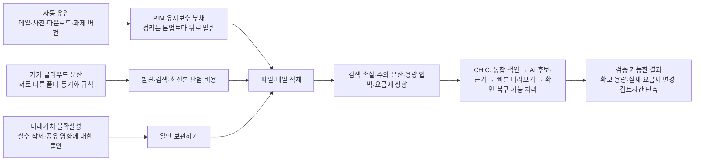

# CHIC 이론적 근거 및 데이터센터 저장비용 조사

조사 기준일: 2026-08-13  
목적: CHIC 해커톤 초안의 pain point, 해결 방식, ESG·비용 주장을 학술 연구와 1차 자료로 검증한다.

## 0. 결론부터

CHIC의 pain point는 충분히 방어할 수 있다. 다만 가장 강한 문제 정의는 **“저장공간이 모자라다”가 아니라 “흩어진 파일의 중요도를 다시 판단하는 비용이 너무 커서 사용자가 정리를 미룬다”**이다.

문헌이 강하게 뒷받침하는 사실은 다음과 같다.

- 파일·메일 정리는 본업과 경쟁하는 보조 노동이라 계속 뒤로 밀린다.
- 미래에 필요할 가능성, 증거 보존, 정서적 애착, 실수로 지울 두려움 때문에 `keep-by-default`가 발생한다.
- 여러 기기·도구의 서로 다른 구조는 검색, 최신 버전 판별, 동기화 이해를 어렵게 한다.
- 사용자는 지우고 싶다고 생각한 파일도 실제로는 거의 지우지 않는다. 의지보다 실행 마찰의 문제다.
- AI가 삭제를 결정하는 방식보다, **후보를 압축하고 이유를 설명한 뒤 사용자가 빠르게 확인하게 하는 방식**이 연구상 더 안전하고 설득력 있다.

반면 아직 직접 입증되지 않은 것은 다음과 같다.

- 개인 사용자의 파일 중 몇 %가 **여러 클라우드 사이에서** 중복되는지에 대한 대표성 있는 수치
- 한국 대학생 전체에서 이 문제가 얼마나 흔한지와 실제 지불의사
- 일정 용량 삭제가 곧바로 일정량의 탄소, 데이터센터 전력, SSD 수명으로 바뀐다는 고정 환산식

따라서 발표의 핵심 문장은 이렇게 잡는 것이 안전하다.

> 사용자는 파일을 못 지우는 것이 아니라, 흩어진 파일의 중요도를 다시 판정하는 비용과 실수로 지울 위험이 너무 커서 정리를 미룬다. CHIC은 여러 저장소의 후보를 한곳에 모으고, AI가 중복·저가치·유사 파일을 설명 가능한 묶음으로 제안하며, 사용자가 미리보기로 빠르게 확인하고 되돌릴 수 있게 한다.

---

## 1. Pain point의 이론적 구조

아래 다섯 단계는 기존 연구를 CHIC 문제에 맞게 종합한 프레임이다. `PIM maintenance debt` 등의 표현은 개별 논문의 공식 척도명이 아니라, 여러 연구의 결과를 제품 언어로 묶은 **종합 개념**이다.



### 1.1 PIM 유지보수 부채: 유입은 자동, 정리는 수동

[Boardman & Sasse(2004)](https://doi.org/10.1145/985692.985766)는 파일·메일·북마크를 함께 관찰한 31명 연구에서, 정리가 본업을 돕기 위한 부차적 활동이라 사용자가 관리 전략을 점검하거나 개선할 시간이 부족하다고 설명했다. 21명은 받은편지함에 75개가 넘는 항목을 두고 있었고, 이 집단의 평균 받은편지함은 1,137개였다. 이메일은 유입을 통제하기 어려워 특히 적체되었다. 오래된 연구이므로 현재의 유병률 수치로 쓰기보다 **왜 정리가 계속 밀리는지 설명하는 구조적 근거**로 쓰는 것이 적절하다.

대학생에게는 이 메커니즘이 더 직접적으로 관찰됐다. [Sillence et al.(2023)](https://doi.org/10.1080/0144929X.2022.2126948)은 영국 학부생 18명을 인터뷰해 학업 데이터가 학기 동안 누적되고, 관리는 사후적·즉흥적으로 이뤄지며, 이메일 분류와 삭제는 과제보다 우선순위가 낮아 계속 미뤄진다는 점을 확인했다. 참가자들은 정리되지 않은 데이터로 인한 검색시간 증가, 압도감, 불안과 생산성 손실도 설명했다. 표본이 작고 한 대학에 편중된 질적 연구이므로, **김우진 페르소나의 메커니즘**을 뒷받침하지만 한국 대학생의 비율을 말해주지는 않는다.

### 1.2 Keep-by-default: 삭제 판단에는 미래가치와 손실 위험이 붙는다

[Neave et al.(2019)](https://doi.org/10.1016/j.chb.2019.01.037)은 두 표본 424명과 203명으로 디지털 축적 행동을 측정했다. 이메일이 가장 흔히 축적되는 데이터 유형이었고, 미래에 쓸 가능성, 업무상 필요, 일을 했다는 증거, 중요한 것을 실수로 삭제할 걱정 등이 보존 이유로 나타났다. [Sweeten et al.(2018)](https://doi.org/10.1016/j.chb.2018.03.031)의 소규모 질적 연구도 과잉축적, 삭제곤란, 불안을 핵심 테마로 보고했다.

[Vitale, Janzen & McGrenere(2018)](https://doi.org/10.1145/3173574.3174161)는 23명의 파일 보존 행동을 비교해, 저장은 클릭 한 번이면 되지만 나중에 분류·삭제하려면 큰 시간이 들고, 저장공간이 풍부할수록 사용자가 정리 대신 디스크나 클라우드 용량 추가를 선택하기 쉽다고 설명했다. 이는 CHIC이 단순 파일 탐색기가 아니라 **판단 비용을 줄이는 도구**여야 하는 이유다.

### 1.3 분산 비용: 위치보다 ‘내 정보 전체’를 기준으로 보여줘야 한다

[Alon & Nachmias(2020)](https://doi.org/10.1016/j.chb.2020.106292)는 465명에게 3~10개의 정보 플랫폼 사용을 조사했다. 평균 사용 플랫폼은 7.64개였고, 25개 관리행동 중 22개에서 실제 행동과 이상적 행동 사이에 유의한 차이가 있었다. 격차가 클수록 부정적 감정과 낮은 관리 효능감이 나타났다. 표본의 61.3%가 학생이어서 CHIC의 대학생 타깃과도 가깝다.

[Dearman & Pierce(2008)](https://research.ibm.com/publications/its-on-my-other-computer-computing-with-multiple-devices)는  27명을 조사해 여러 기기 사이에서 정보를 관리하는 일을 가장 어려운 컴퓨팅 문제 중 하나로 보고했다. [Marshall & Tang(2012)](https://www.microsoft.com/en-us/research/publication/that-syncing-feeling-early-user-experiences-with-the-cloud/)도 설문 106명과 인터뷰 19명에서 사용자가 동기화를 서로 다른 다섯 개념으로 이해하며, 시스템의 상태와 결과를 더 투명하게 보여줄 필요가 있다고 밝혔다.

다중 클라우드 이용 자체도 관찰된다. [Gujral et al.(2025)](https://doi.org/10.1145/3747188)은 클라우드 사용자 125명에게 복수응답으로 Google 87%, Microsoft 64%, Dropbox 40%, iCloud 39% 이용을 보고했다. 45%는 용량 확장을 위해 결제했고, 공급자 선택이 의도적이었다는 응답은 9%뿐이었다. 그러나 이 연구는 **동일 파일이 여러 클라우드에 중복된 비율**을 측정하지 않았다.

### 1.4 중복과 버전 혼란은 실재하지만, ‘크로스클라우드 중복률’과 같지는 않다

[Henderson(2011)](https://doi.org/10.1002/meet.2011.14504801013)은 10명 인터뷰, 113명 설문, 73명의 실제 파일시스템 스냅샷을 결합했다. 스냅샷에서 동일 파일명 중복은 평균 21.8%, 폴더명 중복은 평균 23.5%였다. 설문에서 47%는 실수로 둘 이상의 사본을 만든 경험이 있었고, 83%는 버전을 별도 파일로 저장했으며, 42%는 최신 버전을 놓친 적이 있었다.

이 수치는 중복·버전 혼란의 존재를 뒷받침하지만, 콘텐츠 해시가 아니라 동일 이름 기준이고 로컬 파일시스템 연구다. 발표에서는 **“실제 파일시스템 연구에서 동일 이름 중복이 평균 21.8%였다”**라고 정확히 말해야 하며, 이를 **“개인 클라우드 데이터의 21.8%가 낭비”**로 바꾸면 안 된다.

### 1.5 의도–행동 격차: 지우고 싶어도 실제 행동은 일어나지 않는다

[Khan et al.(USENIX Security 2021)](https://www.usenix.org/conference/usenixsecurity21/presentation/khan-mohammad)은 인터뷰 17명 뒤 Google Drive·Dropbox 장기사용자 108명의 실제 파일 3,525개를 라벨링했다. 참가자가 이미 ‘쓸모없다’고 판단한 파일은 민감하지 않은 경우 94%, 민감한 경우도 90%에서 삭제를 원했다. 8개월 뒤 하위표본 16명은 원래 삭제하고 싶었던 파일의 86%를 여전히 삭제하고 싶어 했지만, 그동안 실제로 수동 삭제한 참가자는 한 명뿐이었다.

연구의 Aletheia 모델은 `keep/delete/protect` 희망을 전체 79% 정확도로 예측했지만 삭제 예측은 75%, 보호 예측은 37%였다. 연구진도 완전자동 삭제가 아니라 사용자 확인을 명시적으로 권고했다. 이 결과는 CHIC의 핵심을 **AI 자동삭제**가 아니라 **AI 후보 압축 + 사용자 확인**으로 잡게 한다.

---

## 2. 논문 근거 지도

| CHIC이 말하려는 주장 | 핵심 연구와 표본 | 근거 수준 | 발표에서 허용되는 표현 | 주의점 |
|---|---|---:|---|---|
| 대학생은 학업 때문에 파일·메일 정리를 미룬다 | Sillence et al., 학부생 18명 질적 연구 | 중간 | “대학생 질적 연구에서 사후적 정리, 삭제불안, 검색 손실이 관찰됐다” | 한 대학 소표본, 비율 일반화 금지 |
| 여러 플랫폼 사이 관리 격차가 있다 | Alon & Nachmias, 465명·평균 7.64개 플랫폼 | 강함 | “실제와 이상적 관리행동의 격차가 25개 중 22개에서 나타났다” | 횡단 자기보고 |
| 중복·버전 혼란이 실재한다 | Henderson, 스냅샷 73명·설문 113명 | 중간 | “동일 이름 중복 평균 21.8%, 최신 버전을 놓친 경험 42%” | 해시 중복·크로스클라우드 중복 아님 |
| 이메일 적체가 부담과 연결된다 | Dabbish & Kraut, 직장인 484명 | 중간~강함 | “메일량·스팸량은 overload와 양의 관련, overload는 업무조정 저하와 관련” | 2006년 횡단 연구, 인과 금지 |
| 사용자는 삭제 의향이 있어도 행동하지 않는다 | Khan et al., 108명·실제 파일 3,525개 | 강함 | “8개월 뒤 의향은 유지됐지만 실제 수동 삭제는 거의 없었다” | 파일 표집 편향, 모델 성능 일반화 금지 |
| 유사 파일을 함께 제안할 가치가 있다 | KondoCloud, 관찰 69명·평가 59명 | 중간~강함 | “다른 폴더의 유사 파일 정리가 추천 수락 행동에서 더 자주 일어났다” | Drive 한정, 30분 시뮬레이션 |
| 빠른 메일 묶음 삭제 UI가 작동 가능하다 | E-litter, 대학생 중심 Gmail 사용자 45명·10일 | 중간 | “보낸이 묶음·미리보기 UI에서 참가자들이 받은편지함 약 22%를 삭제했다” | 무앱 통제군 없음, 환경메시지 효과는 유의하지 않음 |
| 삭제 강도와 복구기간은 개인·파일별로 달라야 한다 | Ramokapane et al., 클라우드 사용자 20명 참여설계 | 중간 | “중요도·민감도·공유 맥락에 따라 삭제 선호가 달랐다” | 질적·가상 활동 |
| 여러 클라우드를 이용하고 용량에 돈을 낸다 | Gujral et al., 클라우드 사용자 125명 | 초기~중간 | “복수 공급자 이용과 유료 용량 확장이 관찰됐다” | 크로스클라우드 중복은 측정하지 않음 |

학술 연구는 pain의 **존재와 발생 메커니즘**을 강하게 설명하지만, 한국 대학생 시장의 규모와 지불의사를 대신하지는 못한다. 기존 [5,000건 리얼보이스 분석](./real_voice_report_ko.md)에서는 의도표집된 앱 리뷰 가운데 비용·페이월 34.8%, 메일 과부하 24.5%, 멀티클라우드·동기화 18.8%, 중복 16.9%, 수작업 시간 13.7%가 탐지됐다. 이는 실제 언어의 삼각검증 자료이지만, 정리 관련 불만을 의도적으로 많이 포함한 표본이므로 일반 사용자 prevalence로 발표하면 안 된다.

---

## 3. 메일 UX가 핵심인 이유와 연구 기반 설계

### 3.1 이메일 pain의 근거

[Whittaker & Sidner(1996)](https://doi.org/10.1145/238386.238530)는 이메일이 통신뿐 아니라 할 일 관리와 보관 역할까지 떠맡으면서 overload가 발생한다고 설명했다. [Dabbish & Kraut(2006)](https://doi.org/10.1145/1180875.1180941)의 직장인 484명 연구에서는 평균 받은편지함이 311개였고, 수신 메일의 평균 24%가 스팸이었다. 전체 메일량과 스팸량은 overload와 양의 관련을, overload는 업무 조정 저하와 관련을 보였다. 횡단 자기보고이므로 “메일이 생산성을 떨어뜨린다”는 단정적 인과 문장보다 “관련됐다”라고 쓰는 것이 정확하다.

더 직접적으로, [E-litter(2025)](https://doi.org/10.1145/3744198)는 대학생 중심 Gmail 사용자 45명에게 10일 동안 보낸이별 묶음, 개별 snippet·미리보기, 프로모션·소셜·오래된 메일 필터, 큰 메일 우선, 진행률을 제공했다. 참가자들은 조건에 관계없이 받은편지함의 약 22%를 삭제했다. 사전조사 71명 중 55%는 일괄삭제를 선호했다. 다만 무앱 통제군이 없었고, 친환경 피드백 유무에 따른 삭제량 차이도 유의하지 않았다. **환경 guilt보다 빠른 확인과 일괄처리가 제품의 1차 가치**라는 해석이 더 안전하다.

### 3.2 사용자가 제안한 흐름을 이렇게 구현할 근거가 있다

1. **보낸이·유형·시간대별로 후보를 묶는다.**  
   E-litter의 보낸이 묶음 UI와 KondoCloud의 유사 파일 그룹 추천이 직접적인 선행 사례다.

2. **한 화면에서 제목, 보낸이, 날짜, 1~2줄 미리보기를 즉시 보여준다.**  
   사용자가 원문을 매번 열지 않고 중요도를 판정하게 해 검토 비용을 낮춘다.

3. **한 건을 지우면 “같은 보낸이·같은 유형의 오래된 메일도 비슷하게 처리할까요?”를 제안한다.**  
   [KondoCloud(2021)](https://doi.org/10.1145/3472749.3474736) 평가에서 서로 다른 폴더에 흩어진 파일 삭제는 추천 수락 행동의 26.4%, 수동 행동의 3.8%였다. 단, 이 결과는 클라우드 파일 연구이므로 이메일에 그대로 적용되는지는 자체 실험으로 확인해야 한다.

4. **왜 비슷하다고 판단했는지 규칙을 한 줄로 설명한다.**  
   [Brackenbury et al.(UIST 2022)](https://doi.org/10.1145/3526113.3545704)의 44명 연구에서는 “같은 폴더·날짜·유형”처럼 규칙을 텍스트로 요약한 방식이 단순 파일목록보다 검증 가능성과 확신을 높였다.

5. **AI는 삭제하지 않고 선택 범위를 줄인다.**  
   민감도와 미래가치는 모델이 완벽히 판단할 수 없으므로, 삭제 기본값은 체크 해제 또는 사용자 명시 승인으로 둔다.

6. **일괄처리 전 샘플 확인과 처리 후 복구기간을 제공한다.**  
   [Ramokapane et al.(2022)](https://doi.org/10.1145/3546578)은 파일의 중요도, 민감도, 크기, 공유 맥락과 삭제 이유에 따라 즉시 영구삭제와 긴 복구기간에 대한 선호가 달라진다고 보고했다.

추천 화면의 최소 정보는 `판정 이유`, `묶음 개수`, `총 용량`, `가장 오래된/최근 날짜`, `공유·첨부·별표 여부`, `복구 가능 기간`이다. 광고·프로모션이라도 영수증, 예약, 계정복구 메일은 중요할 수 있으므로 카테고리만으로 자동 영구삭제해서는 안 된다.

---

## 4. 데이터센터는 사용자 데이터를 얼마나 비싸게 저장하는가

### 4.1 먼저 ‘비싸다’를 세 층으로 나눠야 한다

1. **산업 전체 비용**: 데이터센터 건설, 서버·스토리지 조달, 전력, 냉각, 네트워크, 인력과 보안에 들어가는 거대한 총비용
2. **사업자의 저장 원가**: 논리적 1TB를 한 달 안전하게 보존하는 내부 비용
3. **사용자가 내는 가격**: 클라우드 객체저장소 가격 또는 iCloud·OneDrive 같은 구독 가격

이 셋은 같지 않다. 데이터센터 산업은 매우 비싸지만, 이미 켜져 있는 장비에서 사용자가 파일 1GB를 더 저장하는 단기 한계비용은 작다. 사용자 가격에는 복제·가용성·네트워크·API·보안·지원·마진이 포함되며, 소비자 구독은 다른 기능과 결합되기도 한다.

### 4.2 산업 전체는 분명 거대하다

[IEA, Energy and AI(2025)](https://www.iea.org/reports/energy-and-ai/executive-summary)에 따르면 2024년 전 세계 데이터센터 투자는 약 5,000억 달러였고, 전력소비는 약 415TWh로 세계 전력의 1.5%였다. IEA는 2030년 전력소비를 약 945TWh로 전망한다. 그러나 [IEA의 구성 분석](https://www.iea.org/reports/energy-and-ai/energy-demand-from-ai)에서 서버가 데이터센터 전력의 약 60%를 차지하는 반면 저장시스템은 약 5%다. 냉각은 효율적인 하이퍼스케일 시설에서 약 7%부터 비효율적인 기업형 시설에서 30% 이상까지 달라진다.

따라서 “데이터센터가 415TWh를 쓰므로 내 파일 삭제가 그 전력을 줄인다”는 계산은 틀리다. 전체 데이터센터 전력을 저장 데이터에 단순 배분할 수 없고, 최근 증가의 상당 부분은 AI 연산 수요다.

### 4.3 현재 공개 소매가격: 저장 1TB의 월 가격은 계층에 따라 약 1달러부터 23달러까지다

아래는 2026-08-13 기준 공개 정가의 단순 비교다. 요청, 검색, 조기삭제, 네트워크 반출, 세금, 약정 할인은 제외했다. 사업자의 **내부 원가가 아니라 고객이 내는 객체저장소 소매가격**이다.

| 서비스·등급 | 공개 저장가격 | 1,000TB를 1년 저장할 때 단순 환산 | 특성 |
|---|---:|---:|---|
| [AWS S3 Standard](https://aws.amazon.com/s3/pricing/) | 약 $0.023/GB·월 | 약 $276,000 | 빈번한 접근, 요청·전송 별도 |
| [Google Cloud Storage Standard, 단일 리전](https://cloud.google.com/storage/pricing) | 약 $0.020/GiB·월 | 약 $240,000 수준 | 위치에 따라 가격 다름 |
| [Backblaze B2](https://www.backblaze.com/cloud-storage/pricing) | $6.95/TB·월 | $83,400 | 반출 무료한도 뒤 별도 과금 |
| [AWS Glacier Deep Archive](https://aws.amazon.com/s3/storage-classes/glacier/) | 약 $0.99/TB·월 | 약 $11,880 | 복구·최소보관기간 제약 |
| [Google Cloud Archive](https://cloud.google.com/storage/pricing) | 약 $0.0012/GiB·월, 즉 약 $1.20/TiB·월 | 약 $14,400 수준 | 검색·최소보관기간 제약 |

이 표가 보여주는 것은 “1TB의 가격”이 하나가 아니라는 점이다. 접근속도와 복구시간을 낮추면 저장가격은 크게 떨어지고, 자주 접근하며 높은 가용성을 요구할수록 올라간다.

### 4.4 공개 재무자료로 본 내부비용의 거친 하한·범위

[Backblaze FY2025 10-K](https://www.sec.gov/Archives/edgar/data/1462056/000162828026016395/blze-20251231.htm)는 연간 매출 1억 4,583.5만 달러, 매출원가 5,704.2만 달러, 매출총이익률 약 61%를 보고했다. 매출원가에는 코로케이션·전력, 네트워크, 장비·리스 감가상각, 고객지원과 가용성 인력, 결제수수료, 소프트웨어와 간접비 등이 포함된다. 회사는 연말 관리 데이터가 약 50억GB라고 밝혔다.

연중 관리 데이터 범위를 약 30억~50억GB라고 두고 연간 매출원가를 단순 나누면, **약 $0.95~$1.58/TB·월**이라는 거친 범위가 나온다.

```text
$57.042M ÷ 12개월 ÷ 3~5M TB ≈ $0.95~$1.58 / TB·월
```

이 값은 회사가 공개한 “저장 원가”가 아니라 본 보고서의 참고 계산이다. 연말 용량을 연평균 용량처럼 썼고, `data under management`가 논리·사용가능·원시 용량 중 무엇인지 불명확하며, 백업과 B2의 제품 믹스·접근패턴도 섞여 있다. 따라서 **“사업자 원가는 정확히 $1/TB·월”**이라고 발표하면 안 된다. 다만 원가의 자릿수가 소비자 구독료와 크게 다를 수 있음을 보여주는 보조 앵커로는 유용하다.

### 4.5 논리적 1GB는 물리적 1GB가 아니다

클라우드는 장애에 대비해 여러 장치와 위치에 데이터를 분산한다. [AWS S3 내구성 문서](https://docs.aws.amazon.com/AmazonS3/latest/userguide/DataDurability.html)는 데이터를 최소 세 개 가용영역의 여러 장치에 저장한다고 설명하지만, 이것이 항상 세 개의 완전한 복사본을 뜻하지는 않는다. [Windows Azure의 LRC 연구](https://www.microsoft.com/en-us/research/publication/erasure-coding-in-windows-azure-storage/)는 3중 복제 대신 약 1.33배 저장 오버헤드의 로컬 재구성 코드를 사용해 내구성과 수리비용을 조정했다. [Facebook f4 연구](https://www.usenix.org/conference/osdi14/technical-sessions/presentation/muralidhar)는 차가운 BLOB 저장에서 유효 복제계수를 3.6에서 2.8 또는 2.1로 낮추는 구조를 설명했다.

즉, 사용자가 100GB를 지웠다고 해서 물리 디스크가 정확히 300GB 비워진다고 말할 수 없다. 저장계층, 압축, 중복제거, 코딩, 버전, 휴지통과 복제정책에 따라 달라진다.

### 4.6 삭제의 경제효과는 ‘즉시 전력 절감’보다 ‘향후 증설 회피’다

[Microsoft·CMU의 저장 배출 연구(HotCarbon 2024)](https://www.microsoft.com/en-us/research/publication/a-call-for-research-on-storage-emissions/)에서는 HDD·SSD 클러스터 전력이 입출력량과 약하게만 연동됐다. 7일간 장비 전력의 표준편차가 약 3%였고, SSD 입출력이 28% 줄어든 구간에서도 전력은 0.04%만 변했다. 파일을 삭제해도 디스크와 랙은 계속 켜져 있기 때문이다.

따라서 올바른 인과관계는 다음과 같다.

> 많은 사용자가 장기간 보유하던 논리 용량을 줄임 → 공급자가 필요한 디스크·랙의 증설 시점을 늦춤 → 장기적으로 설비·전력·내재배출을 회피할 가능성

개인 100GB 삭제의 즉시 데이터센터 현금·전력 절감은 거의 관측하기 어렵다. CHIC은 `탄소 절감 kg`보다 `검증된 삭제 GB`, `중복 GB·월`, `실제 요금제 하향`, `기기교체 지연`을 먼저 측정해야 한다.

---

## 5. 사용자가 실제로 아끼는 돈은 ‘삭제량’이 아니라 ‘요금제 경계’를 넘을 때 생긴다

[Apple iCloud+ 한국 가격](https://www.apple.com/kr/icloud/)은 50GB 월 1,100원, 200GB 월 4,400원, 2TB 월 14,000원, 6TB 월 44,000원, 12TB 월 88,000원이다. 예를 들어 178GB 사용자가 48GB까지 줄이고 실제로 200GB에서 50GB로 변경하면 월 3,300원, 연 39,600원을 절약한다. 1.2TB 사용자가 190GB까지 줄여 2TB에서 200GB로 변경하면 월 9,600원, 연 115,200원이다.

그래서 대시보드는 다음 셋을 분리해야 한다.

- **확보 용량**: 실제 영구삭제와 동기화가 끝난 뒤 공급자 quota에 반영된 GB
- **잠재 절약액**: 현재 사용량이 하위 요금제 경계 아래로 내려갔을 때 가능한 차액
- **실현 절약액**: 사용자가 실제로 요금제를 변경·해지한 뒤 확인된 차액

`200GB 정리 = 3,300원 절약`이 아니라, **“128GB를 더 정리하면 50GB 요금제로 내려갈 수 있어 월 3,300원 절약 가능”**처럼 보여줘야 한다. Microsoft 365처럼 저장공간 외 앱·기능이 묶인 상품은 하향 시 잃는 혜택도 함께 표시해야 한다.

---

## 6. ESG와 SSD 주장의 교정

### 6.1 파일은 e-waste가 아니다

[ITU-T L.1031](https://www.itu.int/epublications/en/publication/itu-t-l-1031-2024-06-guideline-for-the-development-of-an-e-waste-management-system-and-achieving-the-e-waste-targets-of-the-connect-2030-agenda/en)는 e-waste를 폐기된 전기·전자 장비와 그 구성요소로 정의한다. 불필요한 파일은 `digital clutter`, `redundant data`, `storage waste`라고 부르는 것이 맞다.

[Global E-waste Monitor 2024](https://ewastemonitor.info/wp-content/uploads/2024/12/GEM_2024_EN_11_NOV-web.pdf)에 따르면 2022년 전 세계 e-waste는 6,200만 톤이었고, 공식적으로 수거·재활용된 비율은 22.3%였다. CHIC이 e-waste 감소에 기여하려면 파일을 지웠다는 사실만이 아니라, 저장공간 부족 때문에 계획했던 SSD·노트북·휴대전화 교체가 실제로 미뤄졌거나 기존 기기가 재사용·판매·기증됐음을 추적해야 한다.

[EU JRC의 스마트폰 수명주기 연구](https://publications.jrc.ec.europa.eu/repository/handle/JRC124077)는 교체주기를 2년에서 3년으로 늘리는 시나리오에서 탄소발자국이 23~30% 낮아질 수 있다고 추정했다. 이는 CHIC에 유리한 근거지만, **정리 앱 사용이 실제 교체 지연으로 이어진 경우에만** 연결할 수 있다.

권장 포지셔닝은 다음과 같다.

> CHIC은 디지털 클러터를 정리하고, 실제 요금제 하향과 기기교체 지연을 검증해 비용·자원 절감으로 연결하는 서비스다.

### 6.2 저장 배출은 중요하지만, GB당 고정 탄소계수는 부정확하다

[Microsoft·CMU HotCarbon 2024](https://www.microsoft.com/en-us/research/publication/a-call-for-research-on-storage-emissions/)의 특정 Azure 범위에서는 저장 관련 랙과 로컬 저장이 운영배출의 33%, 내재배출의 61%를 차지했다. SSD 랙은 TB당 운영배출이 HDD의 약 4배, 내재배출은 약 10배였다. 이는 저장 인프라의 환경영향이 무시할 수준이 아님을 보여준다.

그러나 이 수치는 IEA의 전체 데이터센터 전력 중 저장시스템 약 5%와 범위가 다르다. 전자는 특정 Azure 클러스터의 운영·내재배출이고, 후자는 세계 데이터센터 장비 전력구성이다. 서로 바꿔 쓰면 안 된다. 지역 전력믹스, PUE, HDD/SSD, 복제, 계층, 유휴율과 장비 수명에 따라 결과도 크게 달라진다. [GHG Protocol의 회피배출 지침](https://ghgprotocol.org/estimating-and-reporting-avoided-emissions)은 명시적 반사실, 수명주기, 시간범위와 데이터 가정을 요구한다.

따라서 `1GB 삭제 = X gCO2e`라는 단일 환산은 사용하지 않는다. 공급자가 검증된 탄소 API나 용량 기반 장기효과 모델을 제공하기 전까지 탄소는 **참고 시나리오**로만 표시한다.

### 6.3 SSD 여유공간은 도움이 될 수 있지만, ‘몇 % 빨라진다’는 보장은 금지한다

[Samsung의 SSD over-provisioning 백서](https://download.semiconductor.samsung.com/resources/white-paper/S190311-SAMSUNG-Memory-Over-Provisioning-White-paper.pdf)는 NAND의 erase-before-write 특성 때문에 가비지컬렉션에 빈 블록이 필요하고, 여유영역이 지속·랜덤 쓰기 성능과 수명에 도움을 줄 수 있다고 설명한다. [Samsung TRIM 백서](https://semiconductor.samsung.com/resources/others/Samsung_SSD_845DC_09_TRIM.pdf)는 운영체제가 삭제 영역을 TRIM으로 알려주면 컨트롤러가 불필요한 데이터 복사를 줄일 수 있다고 설명한다.

그러나 다음을 구분해야 한다.

- 사용자가 비운 **논리적 여유공간**과 제조사가 예약한 **over-provisioning 영역**은 동일하지 않다.
- 효과는 OS·파일시스템·컨트롤러·TRIM 지원과 SSD가 얼마나 가득 찼는지에 따라 달라진다.
- 주로 거의 찬 SSD의 지속·랜덤 **쓰기**와 write amplification에 관련되며, 읽기속도·CPU·RAM·네트워크가 자동으로 개선되는 것은 아니다.
- 삭제는 이미 발생한 NAND 마모를 되돌리지 않는다.

CHIC이 보여줄 수 있는 것은 `여유공간 비율`, `TRIM 상태`, `동일 조건의 정리 전후 쓰기 벤치마크`, `SMART 상태`다. 제품 전체에 공통인 “SSD 성능 X% 향상” 또는 “수명 Y년 증가”는 자체 장치별 실험 없이는 쓰지 않는다.

### 6.4 클라우드 삭제는 휴지통과 백업 보존기간을 고려해야 한다

[Google Drive](https://support.google.com/drive/answer/14933051?hl=en)는 휴지통 파일을 30일 뒤 자동삭제하며, 휴지통에 있는 동안 용량에 포함한다. [Google의 데이터 보존 정책](https://policies.google.com/technologies/retention?hl=en-US)은 삭제 절차가 일반적으로 약 2개월 걸리고 암호화된 백업에는 최대 6개월 남을 수 있다고 설명한다.

따라서 앱의 `삭제 완료`는 적어도 다음 상태로 나눠야 한다.

- 선택됨
- 서비스 휴지통으로 이동됨
- 사용자가 영구삭제를 승인함
- 공급자 quota에 반영됨
- 공급자 백업에서 제거 예정 또는 정책상 잔존 가능

---

## 7. 증거가 직접 지지하는 제품 요구사항

### P0 — 데모와 안전성의 중심

- 여러 저장소를 가로지르는 **통합 읽기전용 색인**
- 바이트 해시가 같은 **정확한 중복**과 이름·시간·내용이 비슷한 **유사 후보**를 명확히 구분
- AI 판단 이유, 신뢰도보다 이해하기 쉬운 규칙, 파일 위치와 공유상태 표시
- 메일의 보낸이 묶음, 즉시 미리보기, 빠른 키보드·스와이프 검토
- “비슷하게 처리할까요?” 제안 뒤 샘플 확인과 명시 승인
- 휴지통·격리함, 처리로그, 되돌리기, 민감·공유 파일 보호
- 삭제 뒤 실제 공급자 quota 재확인

### P1 — 비용효과

- 각 공급자의 요금제 경계와 현재 사용량 표시
- `더 정리해야 할 용량`, `잠재 절약`, `실현 절약` 분리
- 여러 클라우드 일원화 시 이동비용, 반출비용, 기능 손실과 단일사업자 종속 위험 표시

### P2 — ESG와 기기효과

- 삭제 GB가 아니라 중복 데이터의 `GB·월` 감소 측정
- 실제 요금제 하향·해지 추적
- 3·6·12개월 뒤 계획했던 SSD·기기 구매가 지연됐는지 확인
- SSD는 여유공간과 실측 벤치마크만 제공
- 공급자 검증 데이터가 없으면 탄소값은 범위·가정을 함께 표시하거나 아예 생략

---

## 8. 자체 조사가 반드시 메워야 할 공백

문헌만으로 “확실한 실제 수요”까지 완성되지는 않는다. CHIC의 독자적 근거는 **한국 대학생의 실제 메타데이터와 행동**에서 만들어야 한다.

### 8.1 1단계: 광운대 학생 30명 데이터 진단

원문 내용은 서버로 보내지 않고, 가능하면 사용자의 기기에서 메타데이터와 해시를 계산한다.

- 사용하는 기기·클라우드·메일 계정 수
- 로컬·클라우드별 파일 개수와 용량
- 서비스 안·서비스 사이의 정확한 해시 중복 GB
- 이름·날짜·내용 임베딩 기반 버전 유사군 수
- 마지막 접근이 오래된 대용량 파일 수
- 받은편지함 수, 보낸이·프로모션 묶음, 첨부파일 용량
- 현재 요금제와 다음 하위 요금제까지 줄여야 할 GB
- 정리 전 삭제확신, 부담감, 찾는 시간, 지불의사

이 단계에서 처음으로 **“광운대 파일럿 참여자의 크로스클라우드 중복 중앙값은 X%”**라고 말할 수 있다. 30명 결과도 전국 prevalence가 아니라 탐색적 파일럿이라고 표기한다.

### 8.2 2단계: 메일 500건 빠른 검토 실험

기본 메일 목록과 CHIC의 `미리보기 + 보낸이 묶음 + 유사 처리 제안`을 비교한다. 가능하면 순서효과를 줄이는 교차설계를 사용한다.

- 분당 검토·결정 건수
- 삭제 후보 중 사용자가 승인한 정밀도
- 중요한 메일을 삭제 후보로 제안한 비율
- 묶음 제안 수락률과 묶음 해제율
- 500건 검토 완료율과 중도이탈 시점
- 주관적 정신적 부담, 확신, 신뢰
- 7일 안에 복구한 메일 수

핵심 지표는 단순 삭제량이 아니라 **중요 메일을 놓치지 않으면서 검토시간을 얼마나 줄였는가**다.

### 8.3 3단계: 30일 뒤 행동 검증

- 공급자 quota에 실제 반영된 영구삭제 GB
- 요금제를 실제로 낮추거나 계정을 해지한 사람 수
- 정리 상태가 유지됐는지, 다시 쌓였는지
- 잘못 삭제해 복구한 파일 수
- 앱이 제안하지 않았는데 직접 정리한 파급행동
- 계획했던 SSD·기기 구매를 실제로 연기했는지

이 세 단계를 거치면 논문은 메커니즘, 리얼보이스는 언어와 문제 후보, 파일럿은 한국 학생의 실제 규모와 제품효과를 각각 담당하게 된다.

---

## 9. 발표용 주장 등급표

### 강하게 말해도 되는 주장

- 파일·메일 정리는 본업보다 후순위라 누적된다.
- 미래가치와 삭제실수에 대한 불확실성이 보존 기본값을 만든다.
- 실제 파일시스템에서 중복 이름과 버전 혼란이 관찰됐다.
- 이메일 적체와 스팸은 overload와 관련된다.
- 삭제 의도가 있어도 수동 행동은 거의 일어나지 않는 의도–행동 격차가 있다.
- 유사 항목을 설명 가능한 묶음으로 추천하고 사용자가 확인하는 설계가 타당하다.
- 금전 절감은 정리 후 실제 요금제 경계를 넘고 사용자가 변경할 때 발생한다.

### 조건과 한계를 붙여야 하는 주장

- “여러 클라우드를 쓰기 때문에 중복 가능성이 커진다.”  
  복수 서비스 이용은 입증됐지만 크로스클라우드 중복률은 자체 측정이 필요하다.
- “디지털 정리는 데이터센터 증설과 배출을 줄일 수 있다.”  
  대규모·장기적 용량수요 감소와 공급자의 실제 대응이 있어야 한다.
- “SSD 여유공간 확보가 쓰기 성능 유지에 도움이 될 수 있다.”  
  장치, 포화도, TRIM과 작업부하에 따라 달라진다.
- “기기교체를 늦춰 e-waste를 줄일 수 있다.”  
  실제 구매 지연·재사용을 추적해야 한다.

### 쓰지 말아야 할 주장

- “개인 데이터의 X%가 여러 클라우드에 중복된다.”
- “파일은 메모리 e-waste다.”
- “1GB를 지우면 X gCO2가 즉시 절감된다.”
- “100GB를 지우면 SSD가 X% 빨라지고 수명이 Y년 는다.”
- “AI가 안전하게 알아서 삭제한다.”
- “확보 가능 용량만큼 구독료가 이미 절약됐다.”

---

## 10. 발표 본문에 우선 넣을 8개 출처

1. **대학생의 직접 pain** — [Sillence et al., *How do students use digital technology to manage their university-based data?*](https://doi.org/10.1080/0144929X.2022.2126948)
2. **다중 플랫폼의 실제–이상 격차** — [Alon & Nachmias, *Gaps between actual and ideal personal information management behavior*](https://doi.org/10.1016/j.chb.2020.106292)
3. **중복·버전 혼란** — [Henderson, *Document duplication*](https://doi.org/10.1002/meet.2011.14504801013)
4. **메일 overload** — [Dabbish & Kraut, *Email overload at work*](https://doi.org/10.1145/1180875.1180941)
5. **삭제 의도–행동과 AI 정확도 한계** — [Khan et al., *Helping Users Automatically Find and Manage Sensitive, Expendable Files*](https://www.usenix.org/conference/usenixsecurity21/presentation/khan-mohammad)
6. **유사군 추천** — [Brackenbury et al., *KondoCloud*](https://doi.org/10.1145/3472749.3474736)
7. **메일 묶음·미리보기 UX** — [Siy et al., *E-litter*](https://doi.org/10.1145/3744198)
8. **데이터센터 규모·전력구성** — [IEA, *Energy and AI*](https://www.iea.org/reports/energy-and-ai/executive-summary)

부록·질의응답에는 [Neave et al.](https://doi.org/10.1016/j.chb.2019.01.037), [Ramokapane et al.](https://doi.org/10.1145/3546578), [Microsoft·CMU 저장 배출 연구](https://www.microsoft.com/en-us/research/publication/a-call-for-research-on-storage-emissions/), [Global E-waste Monitor 2024](https://ewastemonitor.info/wp-content/uploads/2024/12/GEM_2024_EN_11_NOV-web.pdf)를 배치하면 된다.

## 최종 판단

CHIC의 연구상 가장 강한 경쟁력은 “클라우드를 하나로 합친다” 자체보다 **여러 사일로에 흩어진 정리 결정을 한곳으로 가져와, AI가 판단량을 줄이고 사용자가 안전하게 승인하도록 만드는 것**이다. 메일의 연속 미리보기와 “비슷하게 지워드릴까요?”는 부가기능이 아니라, 정리 의도와 실제 행동 사이의 마찰을 줄이는 대표 UX가 될 수 있다.

데이터센터 비용·ESG는 핵심 pain의 보조 근거로 써야 한다. 산업 전체 규모는 거대하지만 개인 파일 1GB의 단기 원가는 낮고, 삭제가 즉시 전력 감소로 이어지지 않는다. 해커톤에서는 탄소 환산보다 **검증된 용량, 줄어든 검토시간, 실제 요금제 하향, 복구 오류율, 장기적 기기교체 지연**을 보여주는 편이 훨씬 신뢰도가 높다.
